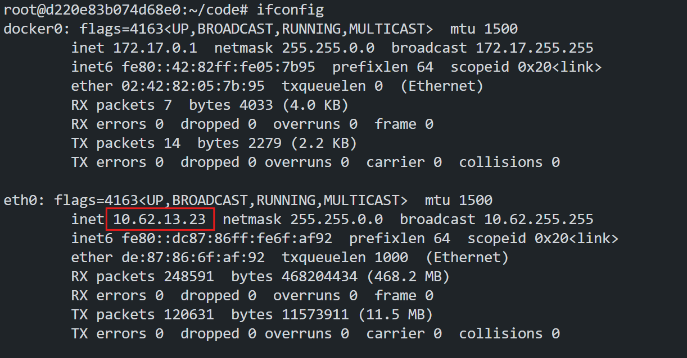
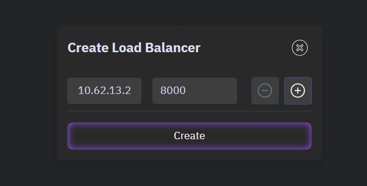
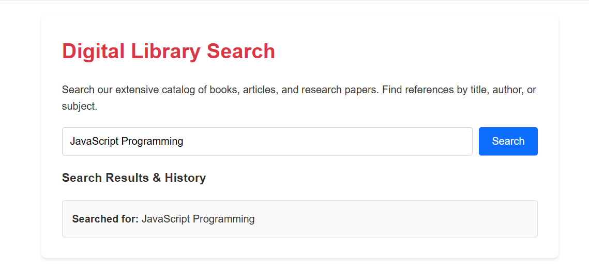
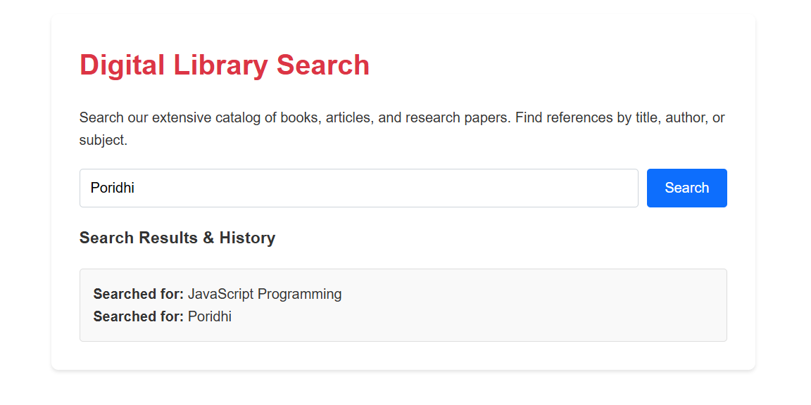
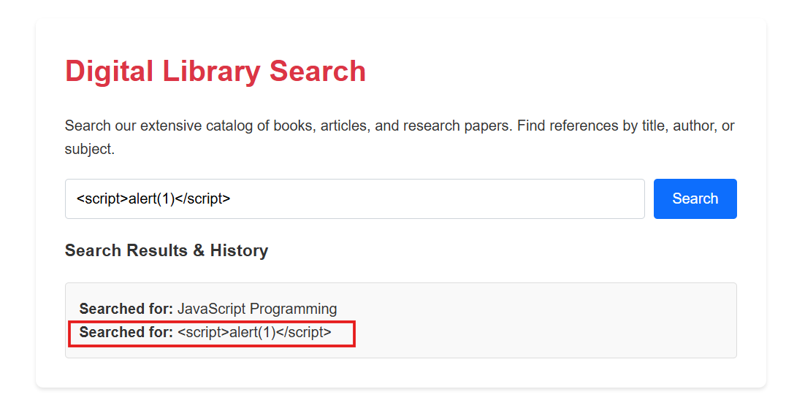
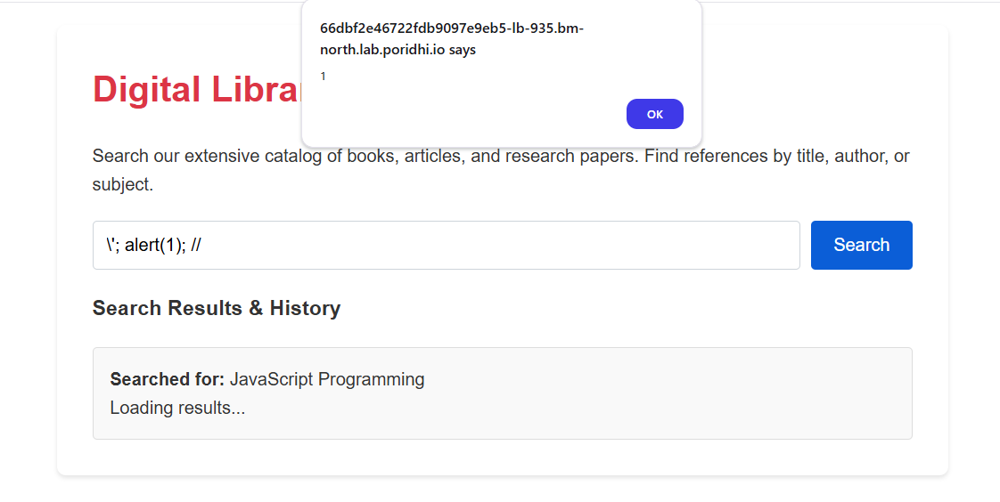

# Reflected XSS into a JavaScript string

In this lab we will see a specific type of Cross-Site Scripting (XSS) vulnerability: **Reflected XSS into a JavaScript string with angle brackets and double quotes HTML-encoded and single quotes escaped**.

In this vulnerability, user input is:

1. Reflected back to the user in the page response (making it a reflected XSS)
2. Inserted directly into a JavaScript string context
3. "Protected" by escaping single quotes with backslashes
4. HTML entities are used for angle brackets and double quotes when displayed in HTML context

We will see how to exploit this vulnerability and how to prevent it.

## What is Reflected XSS?

Reflected XSS is a type of XSS attack where the malicious script is reflected off the web application back to the victim's browser. This type of XSS is common in web applications that handle user input, such as name fields, search fields, comment sections, and login forms.


An attacker crafts a malicious URL containing a script and tricks a user into clicking it. The vulnerable website reflects the script in its response without proper sanitization, causing the user's browser to execute it, leading to data theft or session hijacking.

## Angle brackets and Double quotes HTML-encoded

To prevent `XSS` it is a common practice to HTML-encode the angle brackets and double quotes. Here is a example of how it is done.

```html
<script>
  var x = "";
</script>
```

If we encode the angle brackets, it will be reflected as:

```html
<script>
  var x = "&lt;img src=1 onerror=alert(1)&gt;";
</script>
```
We can also encode the double quotes, it will be reflected as:

```html
<script>
  var x = "&quot;&lt;img src=1 onerror=alert(1)&gt;&quot;";
</script>
```

Here we are encode angle brackets with `&lt;` and `&gt;` and double quotes with `&quot;`.

As we encode the angle brackets and double quotes, the script will not be executed.

## Single quotes escaped

Single quotes escaping is a common practice to prevent `XSS` attacks. Here is a example of how it is done.

### **User input from request parameter**

```javascript
const userInput = request.getParameter("search");
```
### **Attempt to Escape single quotes**
```javascript
const escapedInput = userInput.replace(/'/g, "\\'");
```
Here we are escaping the single quotes with a backslash. (e.g. `'` -> `\'`)

### **Insert into JavaScript string context**
```javascript
const vulnerableCode = `
    var searchTerm = '${escapedInput}';
    document.getElementById('results').innerHTML = 'Results for: ' + searchTerm;
`;
```
But this is not enough to prevent `XSS` attacks. An attacker can still exploit the vulnerability by injecting a specially crafted payload. Now we will see a application that is vulnerable to this type of attack.

## Hands on Lab

To demostrate that on `Poridhi's` Platform, we will deploy a application in `Docker` and then expose it with `Poridhi's` Load Balancer.

### **Step 1: Pull the Docker Image**

```bash
docker pull fazlulkarim105925/reflectedxss:v1.2
```

### **Step 2: Deploy the Application**

```bash
docker run -p 8000:8000 fazlulkarim105925/reflectedxss:v1.2
```

### **Step 3: Expose the Application**

To expose the application with `Poridhi's` Load Balancer, we need to find the `eth0` IP address of the container. To get the `eth0` IP address, we can use the following command:

```bash
ifconfig
```


Create a Load Balancer with the `eth0 IP` address and the port `8000`



### **Step 4: Access the Web Application**

Access the web application with the the provided `URL` by `loadbalancer`



In the search field, you can search for `Books`name or anything, as a demonstration we will not show any results but, search histroy will be reflected in the page.

You can search `Poridhi` and see the search history reflected in the page.



### **Step 5: Exploit the Vulnerability**

From the attackers point of view, they can exploit the vulnerability by injecting a specially crafted payload. 

They stated with injecting direct javascipt into the search field. Like this:

```javascript
<script>alert(1)</script>
```


From the output we can see that the payload is not executed. The payload is rejected by the application. Which confirms that the application handling `script` tag properly. Application is treating is like plain text not as a script.

Now if we try a payload with double quotes:

```javascript
" onmouseover="alert(1)
```


No alert is popped up. This confirms that the application is handling double quotes properly.

Now we will try a payload with single quotes:

```javascript
'; alert(1); //
```


This time also no alert is popped up. This confirms that the application is single quotes.

But we can try to escape the single quotes with a backslash:

```javascript
\'; alert(1); //
```


<p style="color: red;">This time alert is popped up. </p>

**Why this payload is working?**

The payload `\'; alert(1); //` works because:

1. The application escapes single quotes with a backslash (`'` becomes `\'`)
2. When you add your own backslash first (`\'`), it becomes `\\'` in the code
3. In JavaScript, `\\` is interpreted as a literal backslash character
4. This means your single quote now functions as a proper string terminator
5. The resulting code becomes: `'\\'; alert(1); //';`
6. This executes as:
   - `'\\'` (a string containing a backslash)
   - `;` (end of statement)
   - `alert(1);` (your injected code runs)
   - `//` (comments out the rest)

Essentially, we're "escaping the escape" to break out of the string context and execute arbitrary JavaScript.


As we confirms that the application is vulnerable to handling single quotes, we can try more payloads to exploit the vulnerability.

```javascript
\'; alert(document.cookie); //
```
In this payload we are alerting the cookie of the application. Hackers can steal this cookie and send it to their server. Which may cause a session hijacking attack.


## How to prevent this vulnerability?

To prevent this vulnerability, we can use the following techniques:

1. Use `HTML` encoding for angle brackets and double quotes.
2. To prevent single quotes escaping, we can use `HTML` encoding for single quotes. (e.g. `'` -> `&#39;`). So attacker can't use single quotes to break out of the string context.

## Conclusion
In this lab we have seen a specific type of `XSS` vulnerability: **Reflected XSS into a JavaScript string with angle brackets and double quotes HTML-encoded and single quotes escaped**. Here we have seen that escaping single quotes with a backslash is not enough to prevent this vulnerability. We have also seen that we can exploit the vulnerability by injecting a specially crafted payload.
