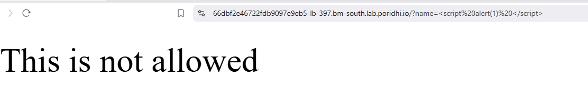
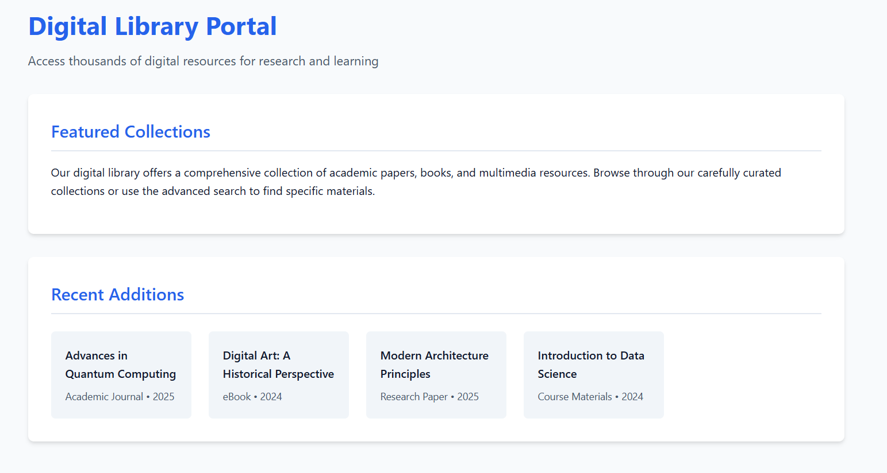
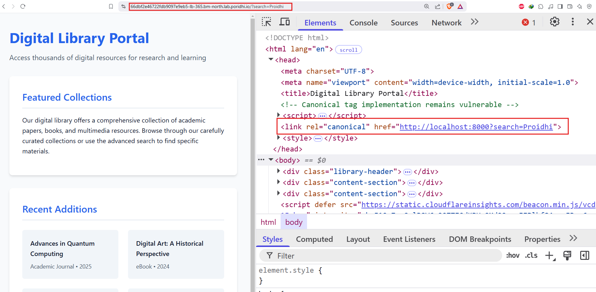
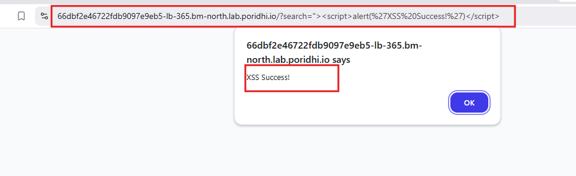

# **Reflected XSS on Canonical Tag**

Reflected Cross-Site Scripting (XSS) is a common web vulnerability that occurs when user input is dynamically included in a webpage's response without proper sanitization or encoding. While many developers secure visible input fields, vulnerabilities can exist in overlooked areas, such as the **canonical tag**.

## Objective

In this lab, we will learn:

- how canonical tags work
- how they can be exploited
- A practical example of how to exploit a reflected XSS vulnerability in the canonical tag
- how to prevent XSS attacks


## **What is a Canonical Tag?**

A canonical tag is an HTML element that helps website owners specify the preferred or "canonical" version of a web page when the same or similar content can be accessed through multiple URLs. It appears in the HTML head section of a webpage as a link element with the rel="canonical" attribute.


Here's what a canonical tag looks like in HTML:
```html
<link rel="canonical" href="https://example.com/main-page" />
```
Here's what it does:
- It tells search engines that "https://example.com/main-page" is the primary version of the page.
- It helps prevent duplicate content issues by consolidating ranking signals from multiple URLs.

## **Use Cases of Canonical Tags**
Canonical tags serve several purposes:
1. **Preventing Duplicate Content Issues**: Helps search engines understand which page to prioritize when multiple versions exist.
2. **Consolidating Link Equity**: Directs all ranking signals (backlinks, page authority) to a single URL.
3. **Managing URL Variations**: Websites often generate multiple URLs with session IDs, tracking parameters, or different structures (`http`, `https`, `www`, `non-www`).
4. **Content Syndication**: When content is republished across multiple domains, canonical tags reference the original source.

## **How Canonical Tags Become Vulnerable to XSS**

Canonical tags can introduce XSS vulnerabilities when **user-controlled input** is directly included in the `href` attribute **without proper encoding**.

### What is Reflected XSS?

Reflected XSS is a type of XSS attack where the malicious script is reflected off the web application back to the victim's browser. This type of XSS is common in web applications that handle user input, such as name fields, search fields, comment sections, and login forms.


An attacker crafts a malicious URL containing a script and tricks a user into clicking it. The vulnerable website reflects the script in its response without proper sanitization, causing the user's browser to execute it, leading to data theft or session hijacking.


### **URL Reflection in the Canonical Tag**
If a webpage dynamically sets its canonical tag based on user input:
```html
<link rel="canonical" href="https://example.com/page?search=USER_INPUT">
```
An attacker can manipulate the URL:
```
https://example.com/page?search="><script>alert('XSS')</script>
```
This results in:
```html
<link rel="canonical" href="https://example.com/page?search="><script>alert('XSS')</script>">
```
which breaks the `href` attribute and allows script execution.

## Hands on Lab

To demostrate that on `Poridhi's` Platform, we will deploy a application in `Docker` and then expose it with `Poridhi's` Load Balancer.

### **Step 1: Pull the Docker Image**

```bash
docker pull fazlulkarim105925/reflectedxss-canonical-tag:v1.0
```

### **Step 2: Deploy the Application**

```bash
docker run -p 8000:8000 fazlulkarim105925/reflectedxss-canonical-tag:v1.0
```

### **Step 3: Expose the Application**

To expose the application with `Poridhi's` Load Balancer, we need to find the `eth0` IP address of the container. To get the `eth0` IP address, we can use the following command:

```bash
ifconfig
```


Create a Load Balancer with the `eth0 IP` address and the port `8000`



### **Step 4: Access the Web Application**

Access the web application with the the provided `URL` by `loadbalancer`




### **Step 5: Exploit the Vulnerability**

In the url of the web application, enter the following payload and hit enter:

```bash
<Loadbalancer URL>?search=Proidhi
```
Now if you open the `Elements` tab of the `developer` tools of the browser, you will see the `canonical tag` is reflected in the page.



As we can see, the `canonical tag` is reflected in the page. We can try to inject a malicious payload to see if it is reflected in the page.

They stated with injecting direct javascipt into the search field. Like this:

```javascript
<Loadbalancer URL>?search="><script>alert('XSS Success!')</script>
```


In this payload, we are injecting a javascript alert box to the page. From the output we can see that the payload is reflected in the page and the alert box is shown which means the we have successfully exploited the vulnerability.

## **Impact of Reflected XSS in Canonical Tags**

If an attacker exploits an XSS vulnerability in a canonical tag, the consequences can be severe:
1. **Session Hijacking**: Stealing authentication cookies.
2. **Credential Theft**: Fake login prompts to capture user credentials.
3. **Website Defacement**: Modifying the website’s appearance.
4. **Malware Distribution**: Injecting malicious scripts to download malware.
5. **Data Exfiltration**: Sending user data to an attacker’s server.

## **Why This Vulnerability Is Overlooked**
- Canonical tags are **not visible** to users, making them easy to miss.
- **Security testing** often focuses on form inputs, not metadata elements.
- Developers may assume **metadata tags are harmless**, overlooking security risks.

## **How to Prevent XSS in Canonical Tags**

To prevent XSS attacks in canonical tags, follow these security best practices:
- Always encode and sanitize input to prevent XSS.
- Use secure DOM manipulation methods instead of `document.write()`.
- Implement a Content Security Policy (CSP) to restrict script execution.
- Regularly test for vulnerabilities, including in metadata elements.

## **Conclusion**

In this lab, we learned how to exploit a reflected XSS vulnerability in the canonical tag. We see a practical example of how to exploit a reflected XSS vulnerability in the canonical tag. We also learned how to prevent XSS attacks in canonical tags.
