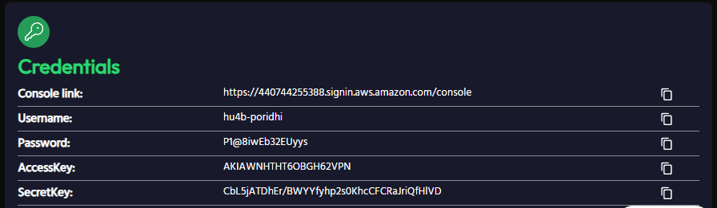

# **Reflected XSS on Canonical Tag in AWS**

Reflected Cross-Site Scripting (XSS) is a common web vulnerability that occurs when user input is dynamically included in a webpage's response without proper sanitization or encoding. While many developers secure visible input fields, vulnerabilities can exist in overlooked areas, such as the **canonical tag**. In this lab, we will see how a application stored in `AWS` can be exploited using `Reflected XSS` on the `canonical tag`.

## Objective

In this lab, we will learn:

- how canonical tags work
- Deploy a vulnerable application in `AWS` with `Terraform`
- how they can be exploited
- A practical example of how to exploit a reflected XSS vulnerability in the canonical tag
- how to prevent XSS attacks

## **What is a Canonical Tag?**

A canonical tag is an HTML element that helps website owners specify the preferred or "canonical" version of a web page when the same or similar content can be accessed through multiple URLs. It appears in the HTML head section of a webpage as a link element with the rel="canonical" attribute.


Here's what a canonical tag looks like in HTML:
```html
<link rel="canonical" href="https://example.com/main-page" />
```
Here's what it does:
- It tells search engines that "https://example.com/main-page" is the primary version of the page.
- It helps prevent duplicate content issues by consolidating ranking signals from multiple URLs.

## **Use Cases of Canonical Tags**
Canonical tags serve several purposes:
1. **Preventing Duplicate Content Issues**: Helps search engines understand which page to prioritize when multiple versions exist.
2. **Consolidating Link Equity**: Directs all ranking signals (backlinks, page authority) to a single URL.
3. **Managing URL Variations**: Websites often generate multiple URLs with session IDs, tracking parameters, or different structures (`http`, `https`, `www`, `non-www`).
4. **Content Syndication**: When content is republished across multiple domains, canonical tags reference the original source.

## **How Canonical Tags Become Vulnerable to XSS**

Canonical tags can introduce XSS vulnerabilities when **user-controlled input** is directly included in the `href` attribute **without proper encoding**.

### What is Reflected XSS?

Reflected XSS is a type of XSS attack where the malicious script is reflected off the web application back to the victim's browser. This type of XSS is common in web applications that handle user input, such as name fields, search fields, comment sections, and login forms.


An attacker crafts a malicious URL containing a script and tricks a user into clicking it. The vulnerable website reflects the script in its response without proper sanitization, causing the user's browser to execute it, leading to data theft or session hijacking.


### **URL Reflection in the Canonical Tag**
If a webpage dynamically sets its canonical tag based on user input:
```html
<link rel="canonical" href="https://example.com/page?search=USER_INPUT">
```
An attacker can manipulate the URL:
```
https://example.com/page?search="><script>alert('XSS')</script>
```
This results in:
```html
<link rel="canonical" href="https://example.com/page?search="><script>alert('XSS')</script>">
```
which breaks the `href` attribute and allows script execution.

## **Hands-on Lab in AWS**
Now we will run a vulnerable `Application` in `AWS` and perform a `Reflected XSS` on the `canonical tag` of the application.

To Deploy the `Application` in `AWS` first we need to create the infrastructure. Including `AWS` `VPC`,`Subnet`,`Route Table`,`Internet Gateway`,`Key Pair`,`EC2 Instance`. Creating this infrastructure is lengthy process. So we will use `Terraform` to create the infrastructure.

**Terraform** is an open-source infrastructure as code tool that allows you to define and provision your cloud infrastructure in a declarative manner. It provides a high-level configuration language to describe your infrastructure in a way that is easy to understand and maintain.

## **Create the Infrastructure with `Terraform`**


### **Step 1: Configure aws credentials**

To get `AWS` Credententals open the lab landing page in right bottom corner in `Poridhi`, Click on Generate Credentails for `AWS`.



It will provide necessary credentials to access `AWS` services.

Copy the `Access Key ID` and `Secret Access Key`.

To Configure the `AWS` try the following command:

```bash
aws configure
```


Use the `Access Key ID` and `Secret Access Key` that was copied to configure the `AWS` credentials. For `region` type `ap-southeast-1` and format as `json`.

### **Step 2: Creating Key Pair**

Create a project folder for the infrastructure

```bash
mkdir aws-infra
cd aws-infra
```
Inside the project folder apply the following command to create the key file

```bash
aws ec2 create-key-pair --key-name my-key --query "KeyMaterial" --output text > my-key.pem
```

After running the command, a key file will be created in the project folder named `my-key.pem`.

Make the key file read only

```bash
chmod 400 my-key.pem
```

### **Step 3: Creating the `main.tf` file**

Create the `main.tf` file in the project folder with the following content:

```bash
provider "aws" {
  region = "ap-southeast-1"
}

# Create VPC
resource "aws_vpc" "my_vpc" {
  cidr_block           = "10.0.0.0/16"
  enable_dns_support   = true
  enable_dns_hostnames = true

  tags = {
    Name = "my-vpc"
  }
}

# Create Public Subnet
resource "aws_subnet" "public_subnet" {
  vpc_id                  = aws_vpc.my_vpc.id
  cidr_block              = "10.0.101.0/24"
  availability_zone       = "ap-southeast-1a"
  map_public_ip_on_launch = true  # Assign public IP automatically

  tags = {
    Name = "public-subnet"
  }
}

# Create Internet Gateway
resource "aws_internet_gateway" "igw" {
  vpc_id = aws_vpc.my_vpc.id

  tags = {
    Name = "my-internet-gateway"
  }
}

# Create Route Table for Public Subnet
resource "aws_route_table" "public_rt" {
  vpc_id = aws_vpc.my_vpc.id

  # Allow all traffic to the internet
  route {
    cidr_block = "0.0.0.0/0"
    gateway_id = aws_internet_gateway.igw.id
  }

  tags = {
    Name = "public-route-table"
  }
}

# Associate Route Table with Public Subnet
resource "aws_route_table_association" "public_association" {
  subnet_id      = aws_subnet.public_subnet.id
  route_table_id = aws_route_table.public_rt.id
}

# Create Security Group for EC2 Instance
resource "aws_security_group" "ec2_sg" {
  vpc_id = aws_vpc.my_vpc.id

  # Allow SSH (Port 22) from anywhere
  ingress {
    from_port   = 22
    to_port     = 22
    protocol    = "tcp"
    cidr_blocks = ["0.0.0.0/0"]
  }

  # Allow HTTP (Port 80) from anywhere
  ingress {
    from_port   = 80
    to_port     = 80
    protocol    = "tcp"
    cidr_blocks = ["0.0.0.0/0"]
  }

  # Allow HTTPS (Port 443) from anywhere
  ingress {
    from_port   = 443
    to_port     = 443
    protocol    = "tcp"
    cidr_blocks = ["0.0.0.0/0"]
  }

  # Allow Application Traffic (Port 8000)
  ingress {
    from_port   = 8000
    to_port     = 8000
    protocol    = "tcp"
    cidr_blocks = ["0.0.0.0/0"]  # Open to all (Modify for specific IPs)
  }

  # Allow all outbound traffic
  egress {
    from_port   = 0
    to_port     = 0
    protocol    = "-1"
    cidr_blocks = ["0.0.0.0/0"]
  }

  tags = {
    Name = "ec2-security-group"
  }
}

# Create EC2 Instance in Public Subnet
resource "aws_instance" "my_instance" {
  ami                    = "ami-0672fd5b9210aa093"
  instance_type          = "t2.micro"
  subnet_id              = aws_subnet.public_subnet.id
  vpc_security_group_ids = [aws_security_group.ec2_sg.id]
  
  associate_public_ip_address = true  # Assign Public IP
  key_name                    = "my-key"  # Use the key pair

  tags = {
    Name = "my-public-ec2"
  }
}

# Output the Public IP of the EC2 instance
output "ec2_public_ip" {
  description = "The public IP of the EC2 instance"
  value       = aws_instance.my_instance.public_ip
}
```

This state file will create the infrastructure and output the public IP of the EC2 instance. Here we have created a `VPC`, `Subnet`, `Internet Gateway`, `Route Table`, `Security Group` and `EC2 Instance`.

### **Step 4: Apply the Terraform State File**

```bash
terraform init
```

This command will initialize the terraform project.

```bash
terraform apply
```

This command will apply the state file and create the infrastructure. While applying the state file, it will ask for `yes` to apply the changes.

After the state file is applied, it will output the public IP of the EC2 instance.


## **Step 5: Setup SSH Config**

To setup SSH config file, run the following command:

```bash
sudo apt install nano -y
```

```bash
nano ~/.ssh/config
```

Then add the following content:

```bash
Host server
  HostName <master-public-ip>
  User ubuntu
  IdentityFile ~/code/aws-infra/my-key.pem
```
To get the public IP of the server, run the following command:

```bash
terraform output
```


### **Step 6: SSH into the EC2 Instance**

Now we can ssh into the `ec2-instance`(server) using the following command:

```bash
ssh server
```
If you ssh for first time, it will ask for `yes` to continue.

Now you are successfully ssh into the `ec2-instance`.


### **Step 7: Install Docker on the EC2 Instance**

Inside the `ec2-instance` create a `install.sh` script for installing `docker`

```bash
nano install.sh
```
Now paste the following script

```bash
#!/bin/bash
sudo apt update -y && sudo apt upgrade -y
# Install dependencies
sudo apt install -y apt-transport-https ca-certificates curl software-properties-common
# Add Docker’s GPG key and repository
curl -fsSL https://download.docker.com/linux/ubuntu/gpg | sudo gpg --dearmor -o /usr/share/keyrings/docker-archive-keyring.gpg
echo "deb [arch=amd64 signed-by=/usr/share/keyrings/docker-archive-keyring.gpg] https://download.docker.com/linux/ubuntu $(lsb_release -cs) stable" | sudo tee /etc/apt/sources.list.d/docker.list > /dev/null
# Update package list and install Docker
sudo apt update -y && sudo apt install -y docker-ce
sudo systemctl start docker && sudo systemctl enable docker
sudo usermod -aG docker $USER
newgrp docker
```

To save the script and exit the nano editor, press `Ctrl + O` ,`Enter` and `Ctrl + X`.

Now make the script executable

```bash
chmod +x install.sh
```

Now run the script

```bash
./install.sh
```

Now you have successfully installed `docker` on the `ec2-instance`.

You can verify the docker installation by running the following command

```bash
docker --version
```


## **Run the Application in Docker**

### **Step 1: Pull the Application from Docker Hub**

```bash
docker pull fazlulkarim105925/reflectedxss-canonical-tag:v1.0
```

### **Step 2: Run the Docker Container**

```bash
docker run -d -p 8000:8000 fazlulkarim105925/reflectedxss-canonical-tag:v1.0
```

### **Step 3: Check the Container Status**

By using the following command you can check the status of the container

```bash
docker ps
```


### **Step 4: Access the Application**

Now you can access the application by going to the `http://<public-ip>:8000` in the browser.


### **Step 5: Exploit the Vulnerability**

In the url of the web application, enter the following payload and hit enter:

```bash
<public-ip>:8000/?search=Proidhi
```
Now if you open the `Elements` tab of the `developer` tools of the browser, you will see the `canonical tag` is reflected in the page.


As we can see, the `canonical tag` is reflected in the page. We can try to inject a malicious payload to see if it is reflected in the page.

They stated with injecting direct javascipt into the search field. Like this:

```javascript
<public-ip>:8000/?search="><script>alert('XSS Success!')</script>
```


In this payload, we are injecting a javascript alert box to the page. From the output we can see that the payload is reflected in the page and the alert box is shown which means the we have successfully exploited the vulnerability.

As javascript is been executed, attacker may able to execute more dangerous payloads like stealing cookies, redirecting to malicious websites, etc.

## **Impact of Reflected XSS in Canonical Tags**

If an attacker exploits an XSS vulnerability in a canonical tag, the consequences can be severe:
1. **Session Hijacking**: Stealing authentication cookies.
2. **Credential Theft**: Fake login prompts to capture user credentials.
3. **Website Defacement**: Modifying the website’s appearance.
4. **Malware Distribution**: Injecting malicious scripts to download malware.
5. **Data Exfiltration**: Sending user data to an attacker’s server.

## **Why This Vulnerability Is Overlooked**
- Canonical tags are **not visible** to users, making them easy to miss.
- **Security testing** often focuses on form inputs, not metadata elements.
- Developers may assume **metadata tags are harmless**, overlooking security risks.

## **How to Prevent XSS in Canonical Tags**

To prevent XSS attacks in canonical tags, follow these security best practices:
- Always encode and sanitize input to prevent XSS.
- Use secure DOM manipulation methods instead of `document.write()`.
- Implement a Content Security Policy (CSP) to restrict script execution.
- Regularly test for vulnerabilities, including in metadata elements.

## **Conclusion**

In this lab, we learned how to exploit a reflected XSS vulnerability in the canonical tag. We see a practical example of an application stored in `AWS` and how to exploit a reflected XSS vulnerability in the canonical tag. We also learned how to prevent XSS attacks in canonical tags.
