# Stored DOM XSS - Client-side JavaScript Injection via API

Stored DOM-based Cross-Site Scripting (XSS) is a dangerous security vulnerability that occurs when malicious scripts are stored in a database and then rendered by client-side JavaScript without proper sanitization. Unlike traditional server-side XSS, DOM-based XSS executes entirely in the browser, making it harder to detect with traditional security tools.

## **Objective**

- Running the vulnerable `Message Board System` in `Docker`.
- Performing a `Stored DOM XSS` attack by injecting malicious JavaScript into messages.
- Understanding how client-side rendering can introduce unique security vulnerabilities.
- Identifying ways to detect and mitigate DOM-based XSS vulnerabilities.
- Demonstrating security best practices to prevent DOM XSS attacks.

## **Understanding Stored DOM XSS**

DOM-based XSS occurs when a web application uses JavaScript to update the DOM with user-controlled data without proper sanitization. In a stored DOM XSS scenario, the malicious input is first saved to a database, then retrieved via an API, and finally processed by client-side JavaScript that inserts it into the page.

For example, instead of a safe message rendering:
```javascript
// Safe rendering
messageContainer.textContent = message.content;
```

A vulnerable application might use:
```javascript
// Vulnerable rendering
messageContainer.innerHTML = message.content;
```

This allows an attacker to inject HTML tags with embedded JavaScript that executes in the victim's browser.

## **Hands-on with Stored DOM XSS**

1. **Pull the Docker Image**

   ```bash
   docker pull yeasin97/stored-lab3:latest
   ```

2. **Run the Docker Container**

   ```bash
   docker run -d -p 5002:5002 yeasin97/stored-lab3:latest
   ```
3. **Create a Load Balancer in Poridhi's Cloud**

   Find the `eth0` IP address with `ifconfig` command, then create a Load Balancer with that IP address and port `5002`.

   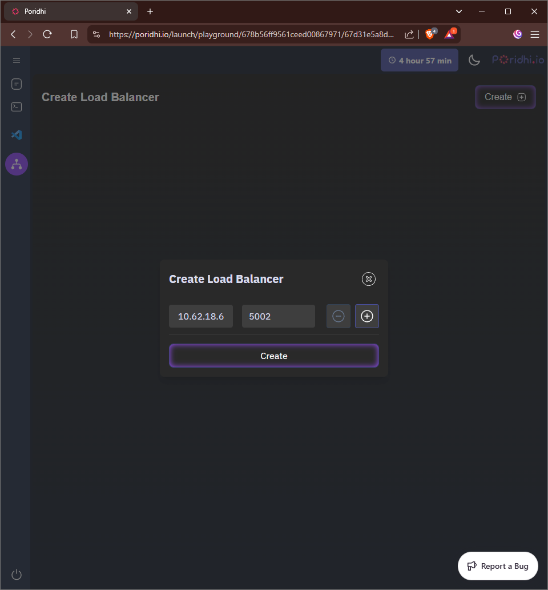
   
4. **Access the Web Application**

   Access the web application through the URL provided by the load balancer.
   
   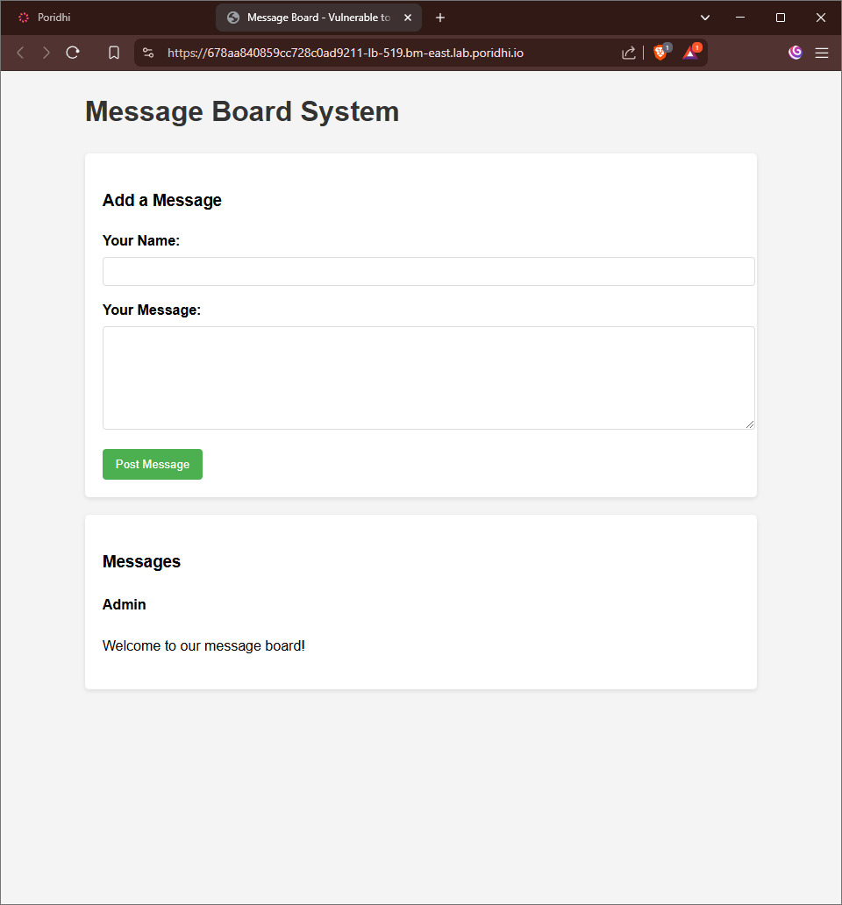
   
### **Exploring the Message Board Application**

This web application allows users to post messages by entering a Username and Message. 

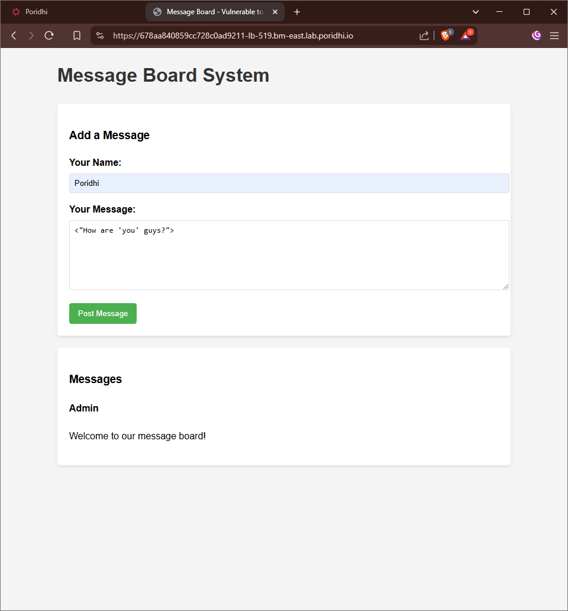

Messages are stored in the database and then loaded via an API call, making it vulnerable to DOM-based XSS if proper sanitization isn't implemented on the client side.

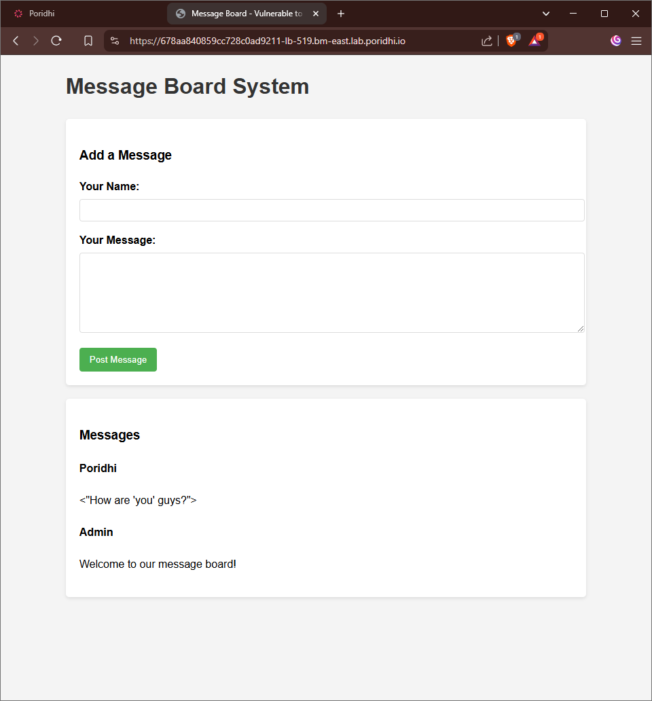

Let's examine how the client-side JavaScript processes and renders messages from the API.

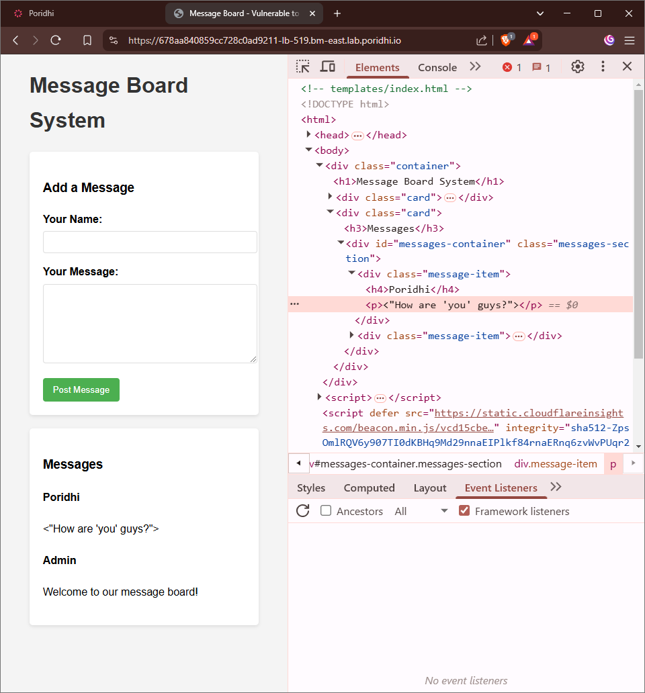

### **Exploiting the Vulnerability**

The application has a vulnerability where it retrieves messages from the API and directly injects them into the DOM using `innerHTML` without sanitization.

To exploit this:

1. Enter any username (e.g., "Attacker")
2. In the message field, enter: ``
3. Click the Submit button

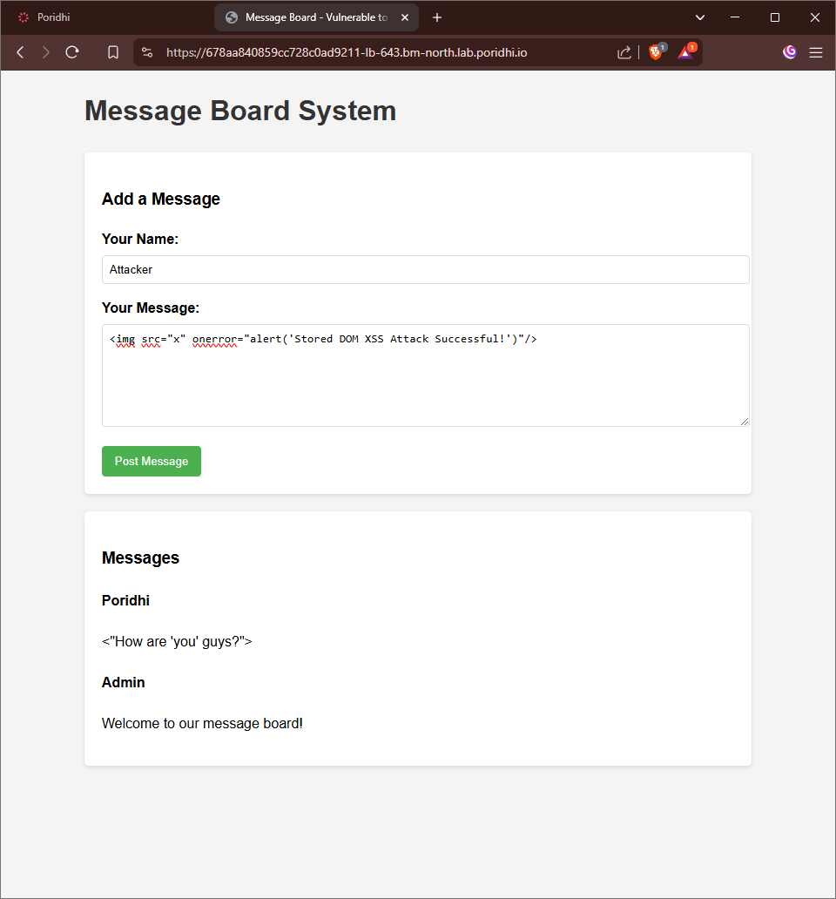

Now when any user visits the page, the JavaScript in your payload will automatically execute in their browser context:

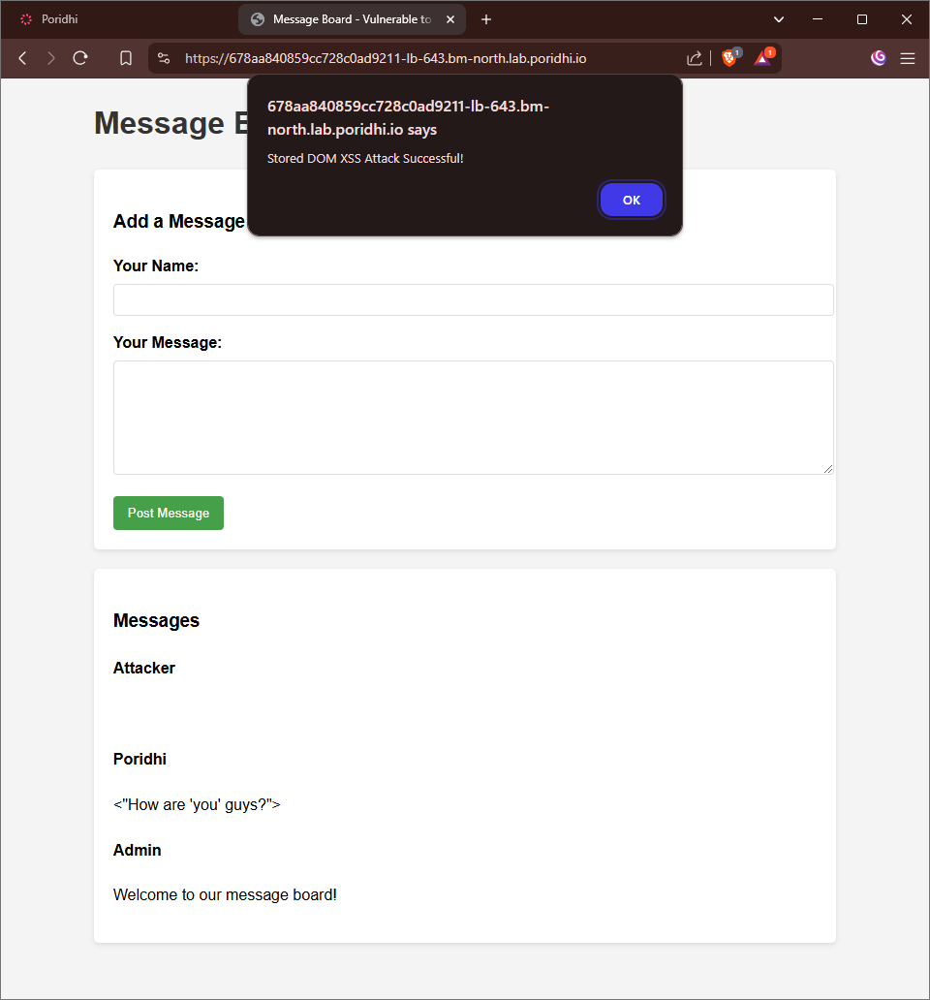

### **Inspecting the Vulnerability**

Using browser developer tools, we can see how the DOM is modified insecurely:

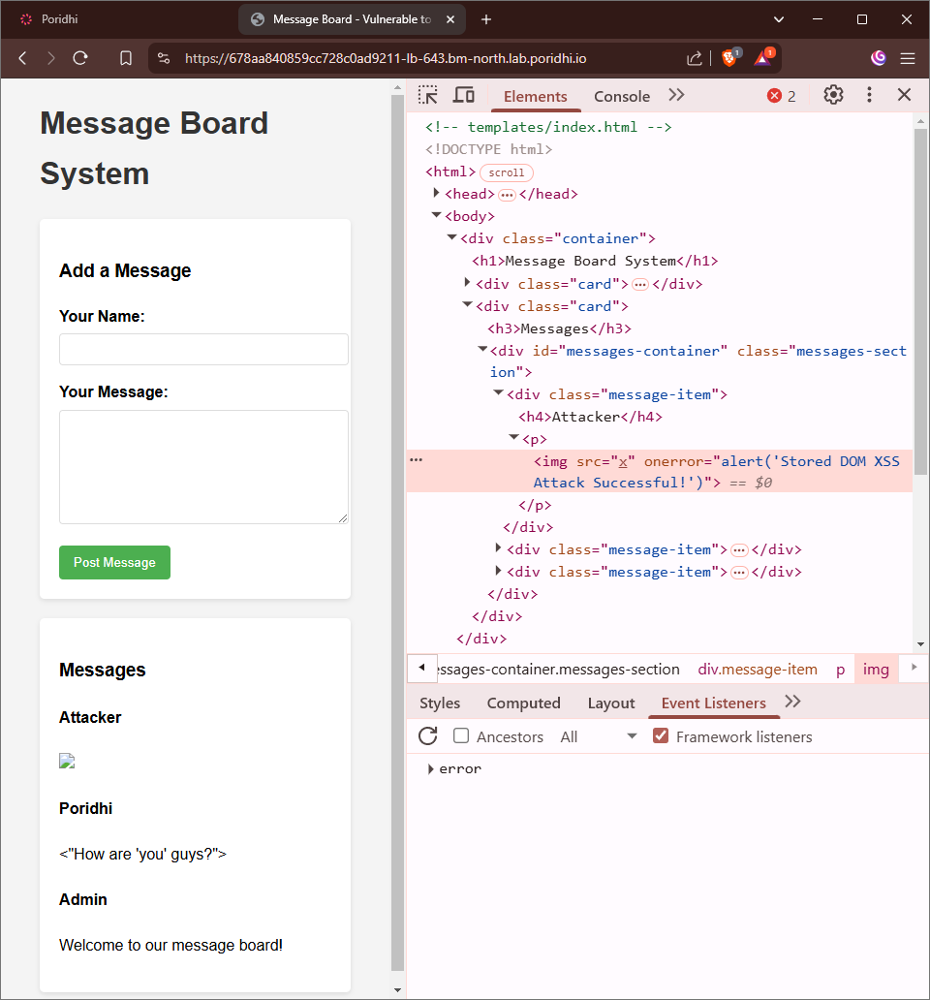

You can try other payloads for more advanced attacks, for example:

```html
<button onclick="alert('The site is hacked and your credential is stolen')">Click Me</button>
```

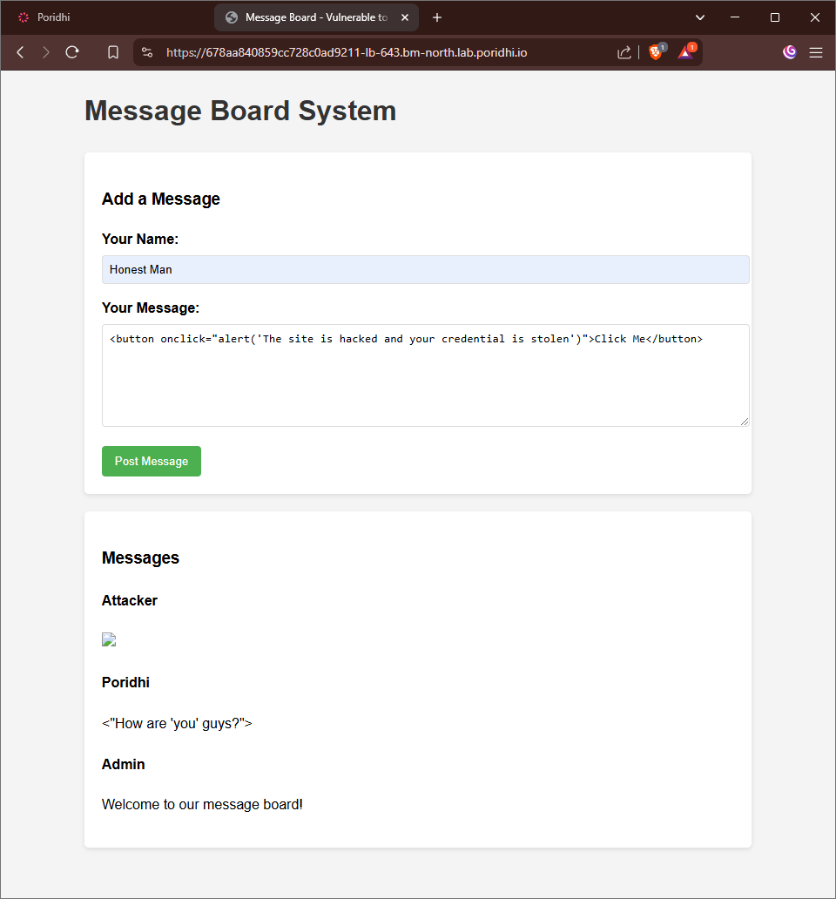

See that a button arrives.

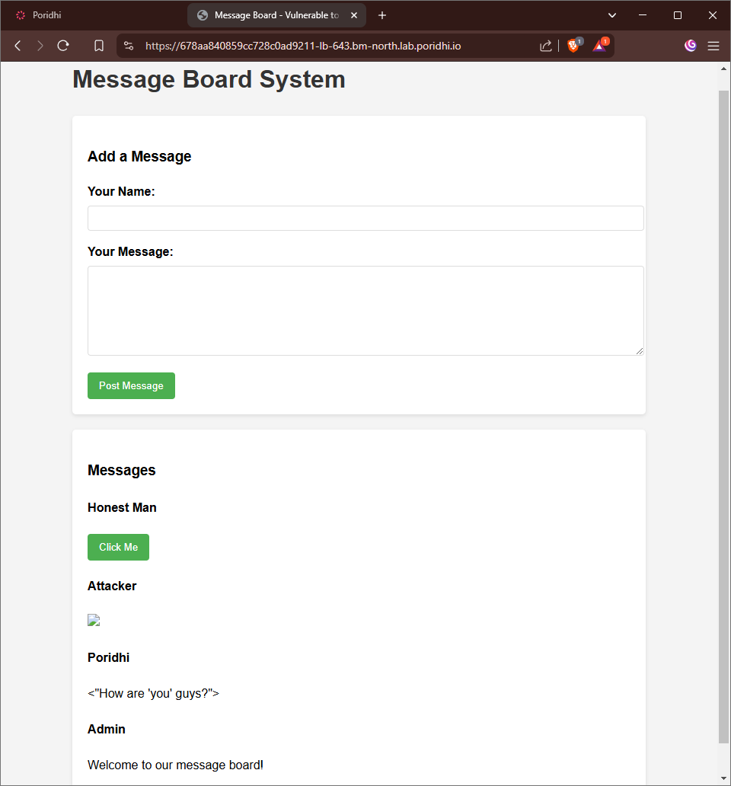

Listen to the honest man.

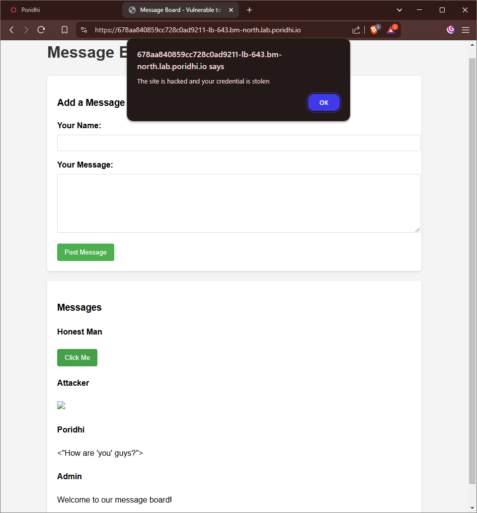

## **Impact of Stored DOM XSS**

This vulnerability allows attackers to:

1. **Automatic Execution**: Execute JavaScript automatically when the page loads, without requiring user interaction
2. **Session Hijacking**: Steal user cookies and session tokens
3. **Phishing Attacks**: Inject convincing fake login forms or notifications
4. **Data Exfiltration**: Steal sensitive information from the page or API responses
5. **Persistence**: Since the attack is stored in the database, it affects all visitors until removed

## **How to Prevent Stored DOM XSS**

### 1. Safe DOM Methods

**Protection Mechanism:** Use safe DOM manipulation methods that don't execute scripts.

**How it protects:** By using methods like `textContent` instead of `innerHTML`, the browser treats injected content as text, not executable HTML/JavaScript.

**Implementation (JavaScript):**
```javascript
// Unsafe
element.innerHTML = message.content;

// Safe
element.textContent = message.content;
```

### 2. Content Sanitization Libraries

**Protection Mechanism:** Use libraries to sanitize data before inserting into the DOM.

**Implementation (JavaScript with DOMPurify):**
```javascript
// Include the library
<script src="https://cdnjs.cloudflare.com/ajax/libs/dompurify/2.3.4/purify.min.js"></script>

// Use in your code
function displayMessage(message) {
    const container = document.createElement('div');
    // Sanitize HTML content before insertion
    container.innerHTML = DOMPurify.sanitize(message.content);
    messagesContainer.appendChild(container);
}
```

### 3. Content Security Policy (CSP)

**Protection Mechanism:** Implement a strict CSP that blocks inline script execution.

**Implementation (Python with Flask):**
```python
@app.after_request
def add_security_headers(response):
    response.headers['Content-Security-Policy'] = "default-src 'self'; script-src 'self'; object-src 'none';"
    return response
```

### 4. Server-side Sanitization

**Protection Mechanism:** Even for DOM-based applications, sanitize data server-side before storing.

**Implementation (Python with Flask and bleach):**
```python
import bleach

@app.route('/add_message', methods=['POST'])
def add_message():
    username = request.form.get('username', '')
    message = request.form.get('message', '')
    
    # Sanitize inputs before storage
    username = bleach.clean(username)
    message = bleach.clean(message)
    
    # Store sanitized data...
```

## **Best Practices for Production**

1. **Defense in Depth**: Implement sanitization at both server and client sides
2. **Avoid innerHTML**: Use safer alternatives like `textContent` or DOM creation methods
3. **Use Modern Frameworks**: Modern frameworks like React, Vue, and Angular have built-in XSS protections
4. **Input Validation**: Validate all inputs on both client and server sides
5. **Regular Security Testing**: Use automated scanners and manual testing to identify DOM XSS vulnerabilities

## **Conclusion**

Stored DOM XSS vulnerabilities present unique security challenges because they exploit client-side JavaScript, often bypassing server-side protections. By understanding how DOM-based XSS works and implementing proper client-side sanitization, developers can effectively prevent these attacks. Remember that complete XSS protection requires both server-side and client-side security measures working together to create a robust defense.